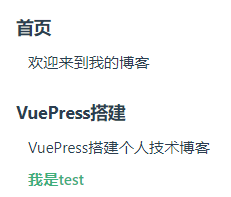
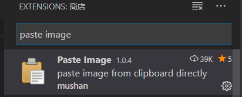
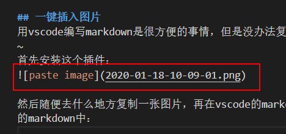
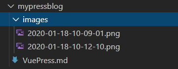
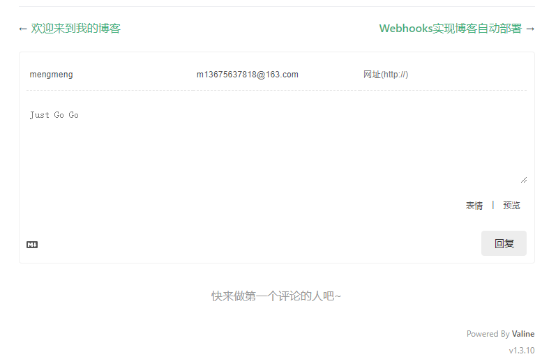
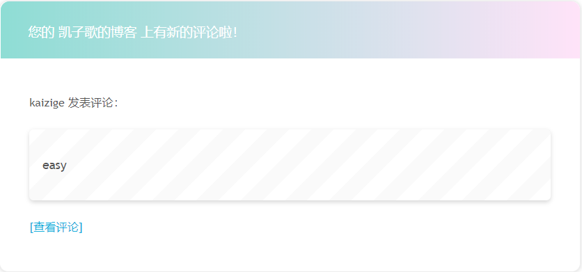
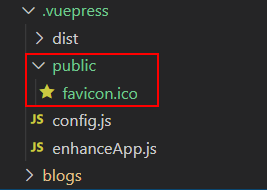
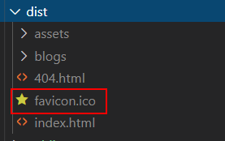

# VuePress搭建个人技术博客

## 目录
[[toc]]

## 为啥要用VuePress
最初我听过xxx，后来无意中发现了VuePress，VuePress有众多优点：12345...，所以我最终选择了它:joy:。


## 搭建一个本地项目
执行以下命令：
```
mkdir myblog
cd myblog
yarn init -y
yarn add vuepress -D
```
在package.json里面添加如下命令进行开发和打包构建：
```json
  "scripts": {
    "dev": "vuepress dev .",
    "build": "vuepress build ."
  }
```
然后就可以愉快地写博客了：`yarn dev`。写好以后打包发布：`yarn build`。

## 自动生成侧边栏
VuePress的侧边栏类似于博客的目录：



它是通过`.vuepress/config.js`配置出来的，如下：
```js
themeConfig: {
    sidebar: [{
        title: '首页',
        collapsable: false,
        children: ['/']
    },
    {
        title: 'VuePress搭建',
        collapsable: false,
        children: [ '/blogs/VuePress搭建/mypress', '/blogs/VuePress搭建/test' ]
    }]
}
```
虽然说非常灵活，但是我依然希望我添加到工程里面的博客文件能自动配置出来，这时候就可以自己撸代码，把sidebar配置根据工程目录结构自动配置出来。

>为了提高解析速度，我们做一些约定，如下：
>- 除首页外，其他所有博客都放在blogs文件夹下面
>- blogs文件夹下的所有文件夹作为分组名
>- 分组下的博客（md文件）作为children，不支持分组下继续嵌套children

然后在`.vuepress/config.js`中添加如下代码：
```js
// 自动查找blogs下面的所有md
const blogFolderName = 'blogs/'
const groups = glob.sync(blogFolderName + '*')
const mdFiles = glob.sync(blogFolderName + '**/*.md')
const sidebarAutoConfigs = groups.map(group => {
    const title = group.substring(blogFolderName.length)
    const groupMdFiles = mdFiles
        .filter(item => item.startsWith(group))
        .map(item => '/' + item.substr(0, item.length - 3))
    return {
        title,
        collapsable: false,
        children: groupMdFiles
    }
})
// 默认首页是README.md或者index.md
const sidebar = [
    {
        title: '首页',
        collapsable: false,
        children: ['/']
    },
].concat(sidebarAutoConfigs);

/* 最后把sidebar添加到themeConfig */
module.exports = {
    themeConfig: {
        sidebar: sidebar
    }
}
```

## 一键插入图片
用vscode编写markdown是很方便的事情，但是没办法复制/粘贴文件，这时候就需要一款支持自动上传文件的插件啦：[Paste Image](https://marketplace.visualstudio.com/items?itemName=mushan.vscode-paste-image)闪亮登场~
首先安装这个插件：



然后随便去什么地方复制一张图片，再在vscode的markdown编辑页面按`ctrl + alt + v`，图片就自动拷贝到项目中了，而且自动插入到了当前的markdown中：



有一个问题就是vuepress是不认识这个图片路径的，因此需要配置一下图片自动保存的路径啦：
比如我喜欢把图片丢到当前md文件目录下的images：



vscode配置方法如下：
```json
{
    "pasteImage.path": "${currentFileDir}/images",// 图片保存的路径
    "pasteImage.prefix": "./"// 图片解析路径的前缀，加了'./'以后VuePress才能识别
}
```

然后只需要`ctrl + alt + v`粘贴图片，然后保存，立刻就能看到效果，是不是很方便呢？

## 评论系统
### 使用Valine作为评论系统
通过[vuepress-plugin-comment](https://github.com/dongyuanxin/vuepress-plugin-comment/blob/master/README.md#use-in-valine)插件，可以很简单地使用Valine作为VuePress的评论系统。
- 注册LeanCloud账号
由于Valine使用LeanCloud作为数据存储，因此我们需要自己注册一个LeanCloud账号。具体步骤可以参考Valine的官方文档：[快速开始](https://valine.js.org/quickstart.html)
- VuePress配置
    1. 安装插件
    ```sh
    yarn add vuepress-plugin-comment -D
    ```

    2. config.js添加配置

    ```javascript
        plugins: [
            [
                'vuepress-plugin-comment',
                {
                    choosen: 'valine',
                    options: {
                        el: '#valine-vuepress-comment',
                        appId: 'LeadCloud上的AppId',
                        appKey: 'LeadCloud上的AppKey',
                        // 解决vuepress切换页面时评论无法刷新的问题
                        path: '<%- frontmatter.to.path %>',
                    }
                }
            ]
        ]
    ```

    这样就OK了，重新部署博客即可看到效果：

    

### 使用第三方工具ValineAdmin进行邮件提醒
由于Valine自带的邮件提醒是基于LeadCloud的修改密码邮件模板，功能比较弱鸡，因此用第三方工具，用户体验会更好一点。
具体如何配置请直接参考[Valine-Admin](https://github.com/zhaojun1998/Valine-Admin)。

效果如下：



## 公共静态资源
比如我想要一个自定义的favicon，怎么做呢？
很简单，vuepress提供了一个公共的机制，即.vuepress/public目录，vuepress就会将其中的文件在打包时丢到dist的根目录下。因此只需要将需要的图片等资源放在这个目录，在博客中就可以直接引用啦~





然后重新打包后刷新浏览器就可以看到效果咯：


## 一些有趣的玩法

### 显示代码行号
我们通过插入md的代码，可以很方便、美观地展示出来，有时需要通过行号来描述，那么可以在`.vuepress/config.js`中添加如下配置：
```js
markdown: {
    lineNumbers: true
}
```

### 启用页面滚动效果
享受丝滑般滚动的效果，还等什么，抓紧开启吧
```js
// .vuepress/config.js
module.exports = {
  themeConfig: {
    smoothScroll: true
  }
}
```
> 页面滚动效果是使用了[vuepress-plugin-smooth-scroll](https://vuepress.github.io/zh/plugins/smooth-scroll)插件。VuePress官方在初始化时内置了此插件。

### 使用emoji表情
有时候很喜欢发一些表情，VuePress也是支持的，直接按如下格式写就可以了：`:joy:`。渲染效果：:joy:
> 所有表情列表：[地址](https://github.com/markdown-it/markdown-it-emoji/blob/master/lib/data/full.json)
