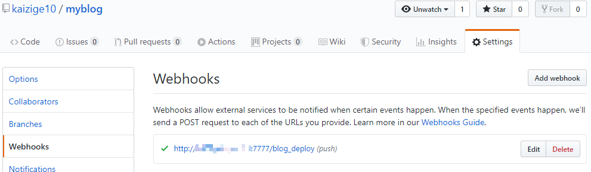
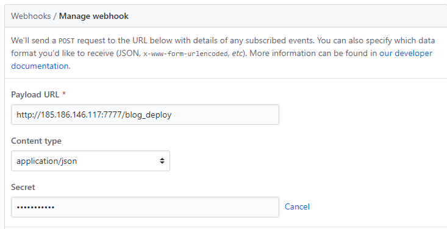
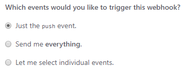
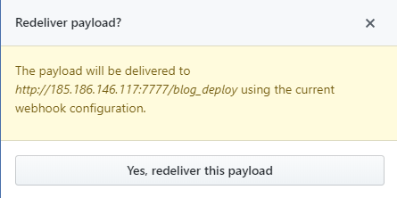
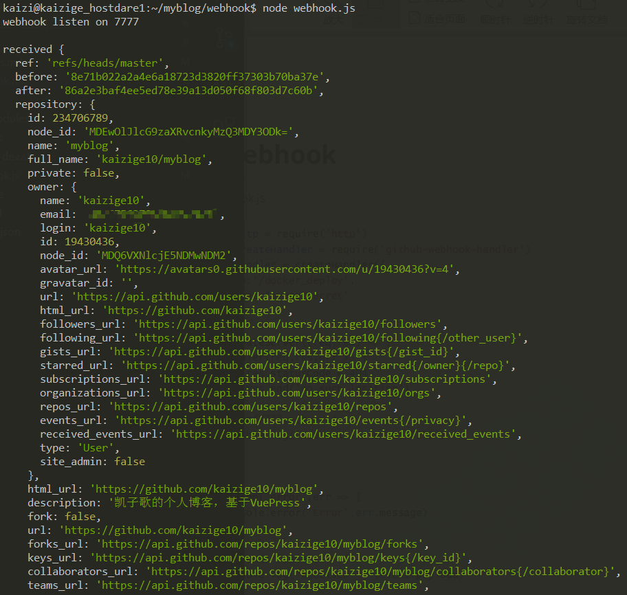
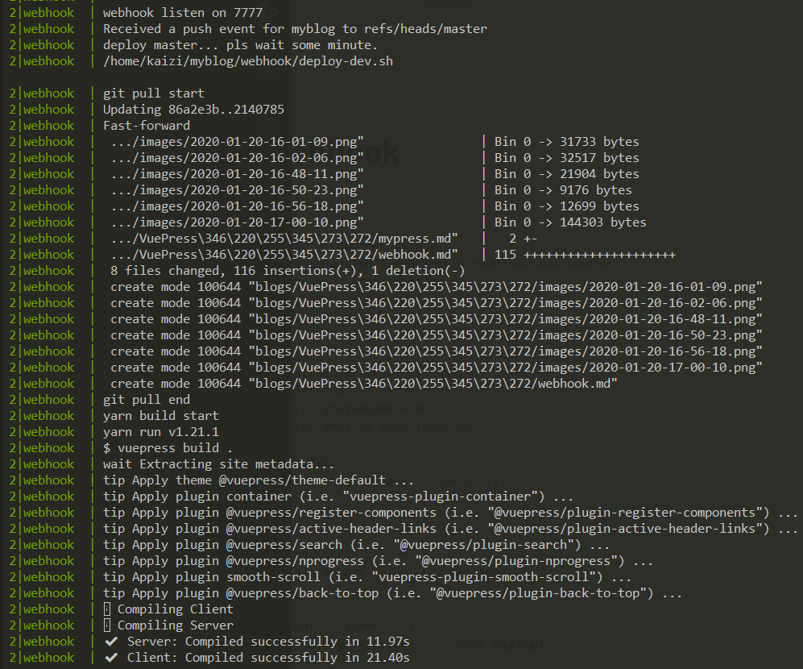
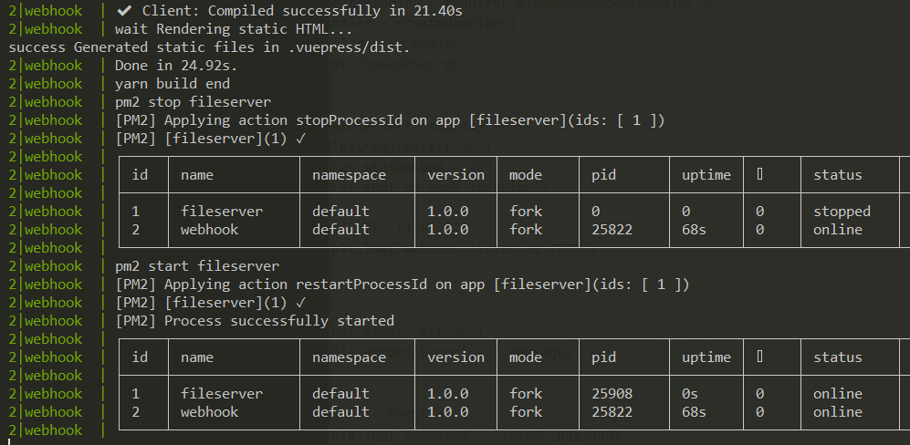

# Webhooks实现博客自动部署

## 目录
[[toc]]
## 背景
每次写完博客，都要`vuepress build`打包，然后上传到服务器进行部署，相当麻烦，利用github的`Webhooks`功能，可以实现提交代码时自动部署博客。

## Webhooks介绍
`Webhooks`允许当特定事件发生时通知外部服务。当这些事件发生时，`Webhooks`将向你提供的每一个URL发送一个POST请求。因此我们可以在接收到github发送的请求时，进行`git更新`、`打包`、`部署`博客等操作。



## 给项目添加一个Webhook
Webhooks在项目的Setting页面，具体配置看图：



- Payload URL：github发送请求的地址
- Content type：用application/json
- Secret：验证身份用的秘钥

触发的事件一般选择push：



## 编写Webhooks请求的服务
先写一个简单的版本进行测试:
```javascript
const http = require('http')
const createHandler = require('github-webhook-handler')
const handler = createHandler({
    path: '/blog_deploy',
    secret: 'suibianyigesecret'
})
http.createServer((req, res) => {
    handler(req, res, err => {
        res.statusCode = 404
        res.end('no such location')
    })
}).listen(7777, () => {
    console.log('webhook listen on 7777')
})

handler.on('error', err => {
    console.error('Error', err.message)
})

handler.on('*', event => {
    console.log('received', event.payload)
})
```
::: tip
[github-webhook-handler](https://github.com/rvagg/github-webhook-handler)是一个npmjs模块，帮助我们更加轻松地使用Webhooks服务。
:::
启动服务以后，在github通过Redeliver发送一次请求：


本地查看收到的请求：


## 编写执行部署任务脚本
使用nodejs的child_process执行部署任务
```javascript
// 监听push事件，然后重新打包、部署我的博客
handler.on('push', event => {
    console.log('Received a push event for %s to %s', 
    event.payload.repository.name, event.payload.ref);
    // 分支判断
    if (event.payload.ref === 'refs/heads/master') {
        console.log('deploy master... pls wait some minute.');
        const deployDevPath = path.resolve(__dirname, './deploy-dev.sh')
        console.log(deployDevPath)

        run_cmd('sh', [deployDevPath], (log) => {
            console.log(log);
        })
    }
})

function run_cmd(cmd, args, callback) {
    const spawn = require('child_process').spawn
    const child = spawn(cmd, args)
    let resp = ''
    child.stdout.on('data', function (buffer) {
        resp += buffer.toString()
    })
    child.stdout.on('end', function () {
        callback(resp)
    })
}
```
`deploy-dev.sh`的内容就是更新代码、执行打包、部署博客（使用pm2）：
```sh
#!/bin/sh

echo 'git pull start'
git pull
echo 'git pull end'

echo 'yarn build start'
yarn build
echo 'yarn build end'

echo 'pm2 stop fileserver'
pm2 stop fileserver

echo 'pm2 start fileserver'
pm2 start fileserver
```
接下来编写博客，然后提交到git，接着查看pm2日志：



大功告成！终于可以开心地编写博客，妈妈再也不用担心我写的博客发不出去啦:smiley:。