# 如何用vscode刷题

最近为了提升自己的算法和数据结构方面的能力，我决定在leetcode中文网上找一些有针对性的题目进行训练，[leetcode](https://leetcode-cn.com/)的题库非常全，而且有十分活跃的社区讨论，非常适合刷题。而vscode又是我最常用的编辑器，用起来非常顺手，调试代码也很easy，所以我选择vscode + leetcode，嗯，真香~:satisfied:

## 目录
[[toc]]

## vscode安装LeetCode插件
在应用商店搜索leetcode就可以看到了：

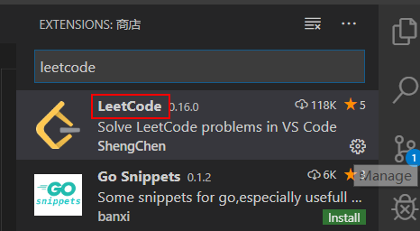

## 切换到中国站点
点击LeetCode插件，然后点地球按钮，选择：启用中国版

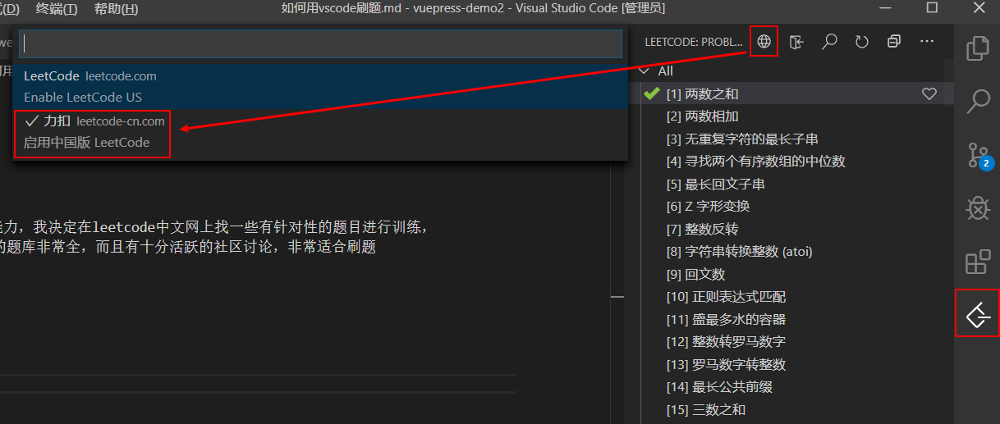

## 登录LeetCode
1. 点击登录按钮
2. 选择leetcode账号（或者第三方的github也可以）
3. 输入用户名或者密码

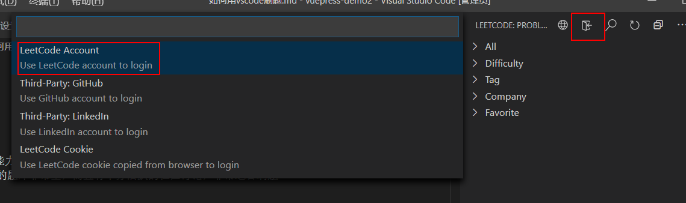

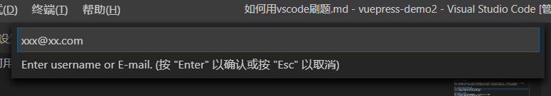

::: warning
用vscode插件登录美国站点会失败，建议选择中国站点登录，注意要使用中国站点注册的账号，因为两者的账号信息是不互通的~
:::

## 开始刷题吧
1. 因为题目比较多，建议通过搜索功能来找题：

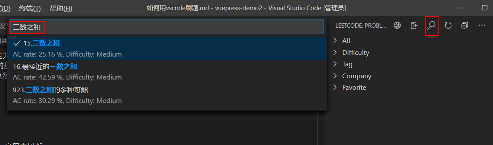

2. 题目打开后，就可以看到题目的描述和编辑区域了

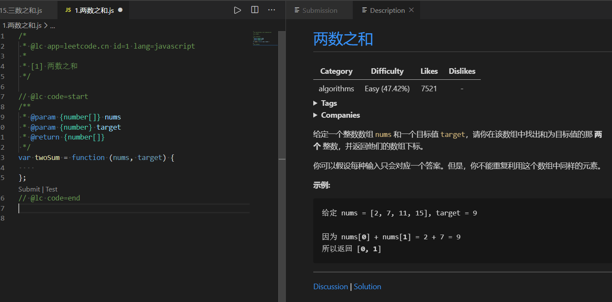

::: tip
第一次使用时，LeetCode插件会要求选择一个路径保存编辑后的文件哦~
:::

3. 做完题目，点击Test可以使用默认的测试用例来测试代码

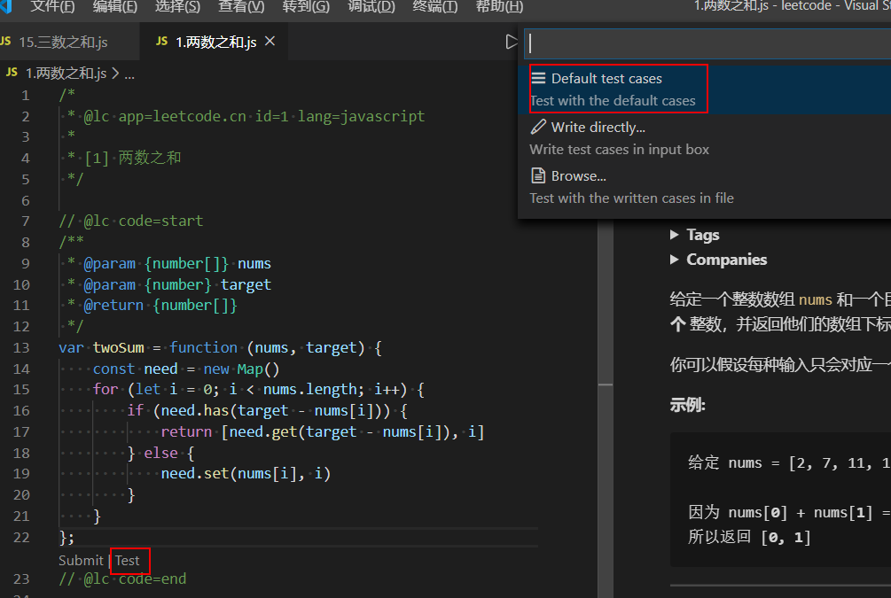
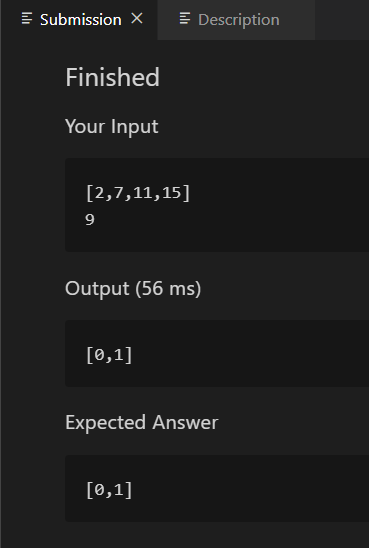

4. 点击Submit可以提交代码，并执行所有的测试用例。LeetCode将展示是否通过，以及用例执行的时间和内存使用情况

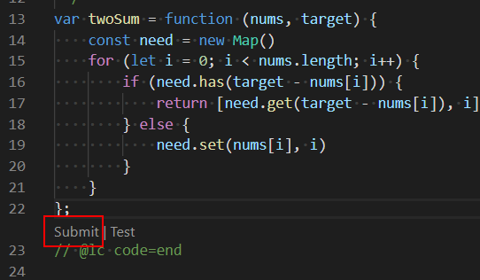
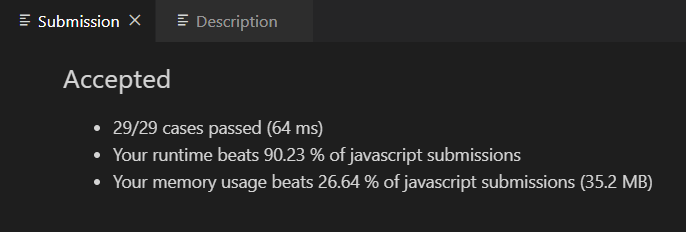

## 参与社区讨论
如果题目比较难，或者一时想不到好的解法，可以去leetcode社区寻找思路和答案。在vscode中点击Discussion或者Solution就可以跳转到当前题目的评论和题解页面：

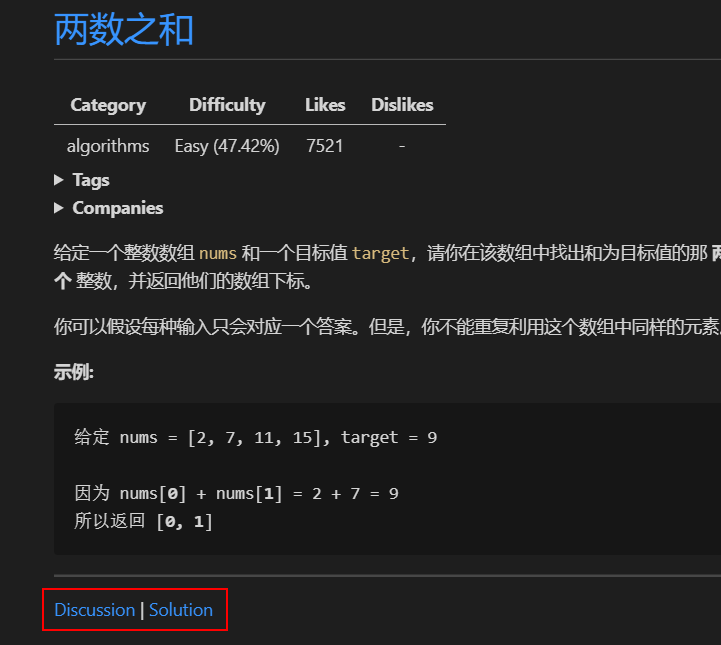

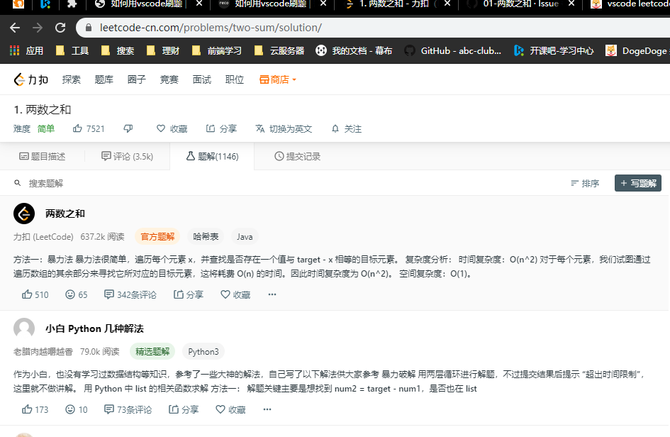

