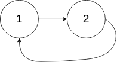
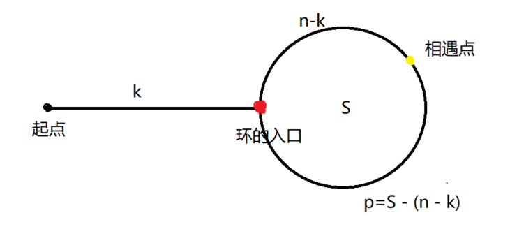
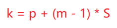

# 142-环形链表2

[[toc]]

## 题目描述
给定一个链表，返回链表开始入环的第一个节点。 如果链表无环，则返回 null。

为了表示给定链表中的环，我们使用整数 pos 来表示链表尾连接到链表中的位置（索引从 0 开始）。 如果 pos 是 -1，则在该链表中没有环。

**说明：** 不允许修改给定的链表。

**示例 1：**

**输入：** head = [3,2,0,-4], pos = 1</br>
**输出：** tail connects to node index 1</br>
**解释：** 链表中有一个环，其尾部连接到第二个节点。


**示例 2：**

**输入：** head = [1,2], pos = 0</br>
**输出：** tail connects to node index 0</br>
**解释：** 链表中有一个环，其尾部连接到第一个节点。



**示例 3：**

**输入：** head = [1], pos = -1</br>
**输出：** no cycle</br>
**解释：** 链表中没有环。


**进阶：**
你是否可以不用额外空间解决此题？

## 解题思路
- 首先，如果该链表无环，那么从head节点遍历，最终一定以null结束
- 其次，有环的情况下，要先分析出当前是否有环，然后再找到环的入口。
    1. 方法一：使用哈希表保存已走过的节点。当有环时，会第二次遍历到环的入口，此时在哈希表中可以查到之前的节点，那么此时一定有环，且当前正在遍历的节点就是环的入口。此法最为简单，但是会占用更多地存储空间。

    2. 方法二：快慢指针法。为了减少内存的占用，我们仅使用少量的几个变量来解决这个问题。第一阶段，通过建立2个指针，快指针腿比较长，每次走2步；慢指针腿短，每次只能走1步。一旦有环，快指针和慢指针在环中运动时，必然会在环中的某一点相遇的。但快慢指针的问题就是，相遇点未必是环的入口，因此第二阶段需要进一步分析环的入口在哪里。请看下图：

    

    由于涉及到路程的计算，我们先定义几个变量：
    - `k`：环的入口到起点的距离。
    - `n`：快慢指针相遇时慢指针走过的距离。
    - `n - k`: 快慢指针相遇时慢指针在环中走过的路的长度。
    - `S`：环的长度。
    - `p`：相遇点继续遍历到环的入口的距离。`p`也等于`S - (n - k)`
    
    我们知道，快指针走过的路程是慢指针的2倍，即`2n`。而快指针一定是比慢指针多走了一圈或者多圈长度的，即`mS`(m是大于等于1的正整数)。因此我们可以得到： `2n - n = mS`，即`n = mS`。也就是说慢指针走过的长度为环的长度的m倍。

    所以我们可以计算得到相遇点到环的入口的的距离为`p = S - (n - k) = S - (mS - k) = (1 - m)S + k`。即`p= (1 - m)S + k`，两边移动一下位置就是：`k = p + (m - 1)S`，翻译过来的意思就是k的长度等于p的长度加上环的长度的倍数：

    

    哟西，答案就显而易见啦:smile:：设定2个新的指针，一个从起点出发走k步，一个从相遇点相遇也走k步，根据k的长度等于p的长度加环的倍数，我们知道这两个新的指针一定能在环的入口相遇。

## 代码实现

思路有了，代码就很清晰啦。如下。
### 1.哈希表保存
```javascript
var detectCycle = function(head) {
    const set = new Set()
    let cur = head
    while(cur) {
        if (set.has(cur)) return cur//哈希表中存在，那么表明有环
        set.add(cur)
        cur = cur.next
    }
    return null
};
```
### 2.快慢指针
```javascript
var detectCycle = function(head) {
    if (head == null || head.next == null) return null
    let slow = head.next, fast = head.next.next
    // 阶段1，快指针每次走2，慢指针每次走1，相遇时找到环
    while(slow != fast) {
        if (fast == null || fast.next == null) return null
        slow = slow.next
        fast = fast.next.next
    }
    // 阶段2：指针1从head开始走，指针2从相遇点开始走，当他们相遇时，即为环的入口
    let p1 = head
    let p2 = fast
    while(p1 != p2) {
        p1 = p1.next
        p2 = p2.next
    }
    return p1
};
```

## 复杂度
### 1.哈希表保存
遍历一次即可完成，时间复杂度为O(n)。使用了哈希表存储，遍历时会线性增长，空间复杂度O(n)

### 2.快慢指针
第一阶段遍历的次数为n，第二阶段遍历的次数为k，而k < n，因此时间复杂度为O(n)。由于只使用了4个指针，因此空间复杂度是常量级别的，为O(1)。