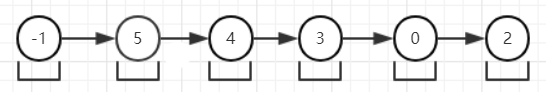
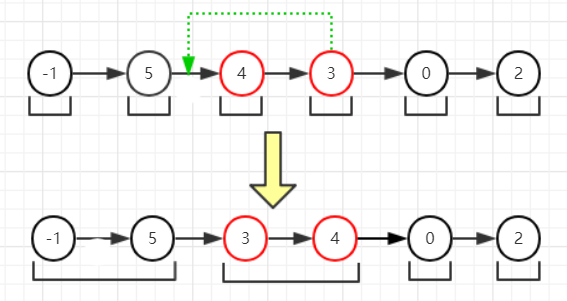
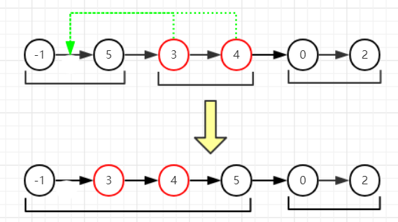
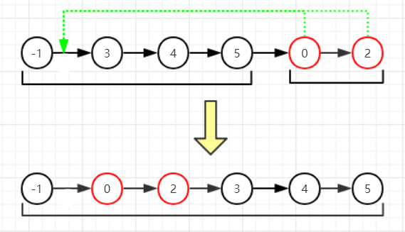

# 148-排序链表
[[toc]]

## 题目描述
在 O(n log n) 时间复杂度和常数级空间复杂度下，对链表进行排序。


>示例 1:</br>
输入: 4->2->1->3</br>
输出: 1->2->3->4

>示例 2:</br>
输入: -1->5->3->4->0</br>
输出: -1->0->3->4->5

## 解题思路
排序的方法有很多种，但是题目要求在 **O(n log n)** 时间复杂度和 **常数级** 空间复杂度。基于 **O(n log n)** 时间复杂度的排序算法有快速排序、堆排序和归并排序。下面来分析一下。

### 快速排序算法
快速排序需要使用两个指针对数组进行范围扫描，一个正向一个逆向，这个操作在单向链表中是无法做到的，因此先排除快速排序算法。

### 堆排序算法
堆排序通过使用 **大顶堆（或小顶堆）** 这一特殊的数据结构来进行排序的，在调整堆结构的过程中需要利用数组的下标，这一操作用链表比较难以实现。因此也不考虑堆排序算法。

### 归并排序算法
归并排序采用经典的`分制思想`来进行排序。`分`即将无序序列一步步地分解为最小长度的序列，`制`即将分解后的小序列进行排序和合并。通过这种思路将一个大问题分解成很多容易解决的小问题，这样问题解决起来就比较简单了。

> 注：对2个有序链表进行合并时，时间复杂度为 **O(n)** ，空间复杂度为 **O(1)** ，可以参考这道题：[合并两个有序链表](https://leetcode-cn.com/problems/merge-two-sorted-lists)。

为了便于理解`归并排序算法`，请看下面的图解：

1. 将原始链表分解成长度为1的n个子链表：（假设要排序的链表为-1 -> 5 -> 4 -> 3 -> 0 -> 2）



2. 第一次，将长度为1的子链表两两合并排序。-1和5无需改变位置；3比4小，所以把3移动到4之前；0和2不需要改变位置：



3. 第二次，将长度为2的子链表两两合并排序。先合并-1->5和3->4，由于3比-1大，比5小，因此把3插入到-1和5之间，4同理。0->-2没有其他链表可以合并，因此不动：



4. 第三次，将长度为4的子链表两两合并排序。即合并-1->3->4->5和0->2两个链表：0大于-1，小于3，因此插入到-1和3之间。2大于0小于3，因此插入到0和3之间，右侧的链表由于长度不足，因此无需继续遍历左侧链表了：



5. 由于链表的长度为5，子链表的长度最大只能为4，此时循环终止，排序结束。

## 代码实现
```javascript
// 思路2：归并排序，把链表一层层地分解成长度为1小链表，进行排序，
// 排序完成后合并成长度为2的链表，然后再合并排序，依次类推。
// 分解的次数为log n
// 排序后的链表进行合并操作
// 由于排序后的链表合并操作时间复杂度只有O(n)，空间复杂度为O(1)，
// 因此总的时间为O(n*log n)
var sortList = function (head) {
    // 0个或者1个直接返回
    if (!head || !head.next) return head
    // 为了方便，定义sentinel节点即哨兵节点，
    // 在这里用于作为虚拟头部节点，即head的前一个节点
    let n = 1, len = 1, cur = head.next, sentinel = new ListNode(null)
    sentinel.next = head
    while (cur) {
        // 第一次遍历找到链表长度
        len++
        cur = cur.next
    }
    while (n < len) {
        // 用prev记录每次合并时左边链表的前一个指针
        let prev = sentinel
        while (prev) {
            prev = mergeList(prev, n)
        }
        // 每次归并的子链表长度翻倍：1,2,4,8
        n *= 2
    }
    return sentinel.next
}

/**
 * 合并2个链表，输出是合并后链表的最后一个节点
 * @param {ListNode} sentinel 第一个链表的前一个节点
 * @param {number} n 链表长度
 */
function mergeList(sentinel, n) {
    let i = 0, cur = sentinel
    // 循环n次，找到p1链表的尾巴和p2链表的头
    while (i < n) {
        if (cur.next) {
            cur = cur.next
            i++
        } else {
            // 左边链表如果长度不足，那么无需合并，直接返回空
            return null
        }
    }
    let p1Tail = cur, p1 = sentinel.next, p2 = cur.next, prev = sentinel
    
    // 合并p1和p2
    // 此时用i记录p2移动的次数
    i = 0
    // p2移动次数最多为n
    while (p2 && i < n) {
        if (p1.val > p2.val) {
            // p1大于p2，把p2插入p1左侧
            p1Tail.next = p2.next
            prev.next = p2
            p2.next = p1
            // 插入结束把p2指向下一个
            if (++i == n) {
                // p2到底了，直接返回尾巴，即p1Tail
                return p1Tail
            } else {
                prev = p2
                p2 = p1Tail.next
            }
        } else {
            // p1小于等于p2
            if (p1 == p1Tail) {
                // p1到底了，说明p2以及后面的都比p1的大，那么直接退出循环
                break
            } else {
                // p1没到底
                if (p1.next.val <= p2.val) {
                    // 先判断左边的next是否小于等于右边，是的话p1前进一步
                    prev = p1
                    p1 = p1.next
                } else {
                    // 不是的话p2插入到p1的右侧
                    p1Tail.next = p2.next
                    p2.next = p1.next
                    p1.next = p2
                    if (++i == n) {
                        // p2到底了，直接退出
                        return p1Tail
                    } else {
                        // 插入完成，把p2指向下一个，p1也指向下一个
                        p1 = p2.next
                        prev = p2
                        p2 = p1Tail.next
                    }
                }
            }
        }
    }
    // p2移动次数少于n-1，那么就继续后移到末尾
    while (i < n - 1 && p2) {
        p2 = p2.next
        i++
    }
    return p2
}
```

## 复杂度分析
- 时间复杂度：
    第一次遍历找链表长度，耗时O(n)；然后进行分解链表操作，循环次数为 log<sub>2</sub>n; 每次循环只需要遍历一次链表即可完成合并和排序的操作，耗时为O(n)，因此总耗时为 **O(n + n log<sub>2</sub>n) = O(n log<sub>2</sub>n)**

- 空间复杂度：
    只用了有限个变量保存中间态数据，因此空间复杂度为O(1)。

>P.S. 贴一下我的成绩：
