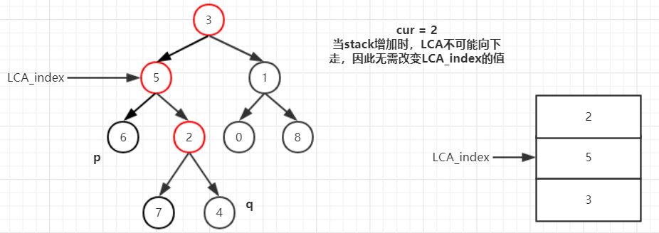

# 236-二叉树的最近公共祖先
[[toc]]

## 题目描述
给定一个二叉树, 找到该树中两个指定节点的最近公共祖先。

百度百科中最近公共祖先的定义为：“对于有根树 T 的两个结点 p、q，最近公共祖先表示为一个结点 x，满足 x 是 p、q 的祖先且 x 的深度尽可能大（一个节点也可以是它自己的祖先）。”

例如，给定如下二叉树:  root = [3,5,1,6,2,0,8,null,null,7,4]


示例 1:
- 输入: root = [3,5,1,6,2,0,8,null,null,7,4], p = 5, q = 1
- 输出: 3
- 解释: 节点 5 和节点 1 的最近公共祖先是节点 3。

示例 2:

- 输入: root = [3,5,1,6,2,0,8,null,null,7,4], p = 5, q = 4
- 输出: 5
- 解释: 节点 5 和节点 4 的最近公共祖先是节点 5。因为根据定义最近公共祖先节点可以为节点本身。
 
::: tip 说明:
- 所有节点的值都是唯一的。
- p、q 为不同节点且均存在于给定的二叉树中。
:::

## 解题思路1: 2次递归
::: tip 小提示
我们把LCA（Lowest Common Ancestor）称为最近公共祖先节点，下文的LCA都是指这个意思。
:::
首先需要找到p的所有祖先和q的所有祖先，我的想法就是用递归去遍历，找2个节点，因此需要遍历2次。假设二叉树为：root = [3,5,1,6,2,0,8,null,null,7,4], p = 6, q = 4。看图：


首先通过递归求得p或q的祖先数组, 每次递归时将祖先数组传递：


因此得到p的祖先数组：[3,5,6]，得到q的祖先数组：[3,5,2,4]：


然后遍历这两个数组，即可找到最近的公共祖先：5。


代码如下：
```javascript
// 思路1：2次递归
// 每次判断当前节点是否是p或者q，参数把祖先节点的数组传入
// 对于最差的单链表的场景，递归的空间复杂度为O(n)，
// 我的解法在某一场景下堆内存不够了：JavaScript heap out of memory
var lowestCommonAncestor1 = function (root, p, q) {
    let ps = getAncestors(root, p, [])
    let qs = getAncestors(root, q, [])

    // 需要遍历的次数是短的那个祖先数组
    let n = Math.min(ps.length, qs.length);
    for (let i = 0; i < n - 1; i++) {
        // 找到下一个不同但当前相同的index
        if (ps[i] == qs[i] && ps[i + 1] != qs[i + 1]) return ps[i]
    }
    // 遍历结束还未找到，说明ps比qs短（或反之），那么LCA就是p或者q
    if (ps.length < qs.length) {
        return ps[ps.length - 1]
    } else {
        return qs[qs.length - 1]
    }
}

/**
 * 递归求得node的所有祖先节点
 * @param {*} root 当前节点
 * @param {*} node p或者q
 * @param {*} ancestors 当前节点的祖先节点
 */
function getAncestor(root, node, ancestors) {
    // 找到了，返回node的祖先节点（含自己）
    if (root == node) return [...ancestors, root]
    // 到达叶子节点，说明找不到，返回空
    if (!root.left && !root.right) {
        return null
    }
    let ans = null
    // 找左子树，找到了就直接返回
    if (root.left) {
        ans = getAncestors(root.left, node, [...ancestors, root])
        if (ans) {
            return ans
        }
    }
    // 找右子树，找到了就直接返回
    if (root.right) {
        ans = getAncestors(root.right, node, [...ancestors, root])
    }
    return ans
}
```

## 解题思路2: 1次递归
2次递归花费的时间比较多，能不能一次搞定呢？

我们来看如下例子：

1. 如果当前节点3不是p(q)，它的左子树没有找到p(q)，它的右子树找到了p(q)，那么当前节点3一定不是LCA。因为LCA要么在节点3的外面，要么在它的右子树：


2. 如果当前节点3不是p(q)，它的左子树找到p(q)，它的右子树也找到了p(q)，那么当前节点一定是LCA，不可能是它的左子节点或者右子节点，如果是，那么不能左子树和右子树都能找到p(q)：


3. 如果当前节点3是p(q)，它的左子树找到p(q)，或者它的右子树找到了p(q)，那么当前节点一定是LCA，这个很好理解：


4. 如果当前节点3不是p(q)，它的左子树没有找到p(q)，它的右子树没有找到p(q)，那么LCA和节点3以及它的子节点没有什么关系：


基于上面四种情况，我们可以在每次递归中直接判断出当前节点是否是LCA，代码如下：
```javascript
// 思路2：一次递归
// 如果当前节点的左子树找到了，并且右子树找到了，那么最近公共节点就是该节点
// 如果当前节点就是p or q，并且左右子树找到了，那么最近公共节点也是该节点
// 如果当前节点就是p or q，并且左右子树都没找到，那么返回true表示作为子树找到了p or q
let node
let lowestCommonAncestor2 = function (root, p, q) {
    findNode(root, p, q)
    return node
};

function findNode(root, p, q) {
    if (!root) return false
    // 我是不是p或者q？
    let meResult = root == p || root == q ? 1 : 0
    // 左子树的结果
    let leftResult = findNode(root.left, p, q) ? 1 : 0
    // 右子树的结果
    let rightResult = findNode(root.right, p, q) ? 1 : 0

    // 自己是，或者左右子树找到了，3种情况有2种满足即找到了最近的公共祖先（自己）
    if (meResult + leftResult + rightResult >= 2) {
        node = root
    }
    // 其他结果
    return meResult + leftResult + rightResult > 0
}
```
:::warning
值得注意的是递归无法提前中断，即使我一开始就发现了LCA，我也不得不继续递归下去，这是递归的一个缺点。下面我们来看迭代的办法。
:::

## 解题思路3: 深度优先的迭代
树的迭代解法一般都需要利用额外的数据结构来完成，这个数据结构就是栈。为了在一次迭代中找到p(q)的所有祖先节点，我需要把所有当前节点的祖先都入栈。即使已经处理过这个节点的左或右子树，也仍然需要暂时保留在栈中，除非它的左右子树全部遍历完成，因此我还需要一个额外的数据结构来存储当前节点的左右子树是否处理过。

1. 从根节点开始


2. 查看节点5


3. 查看节点6


4. 回到节点5


5. 查看节点2


6. 查看节点7


7. 回到节点2


8. 查看节点4


9. 接下来同思路1：遍历这两个数组ps和qs，即可找到最近的公共祖先：5。


代码：
```javascript
// 思路3：迭代，
// 深度优先搜索，使用一个栈保存当前节点的所有祖先，
// 使用哈希表保存当前节点是否访问过左子树和右子树
// 额外空间使用了栈和哈希表，因此空间复杂度是O(n)
var lowestCommonAncestor3 = function (root, p, q) {
    let ps = [], qs = [], stack = [root], isVisited = new Map()
    while (!ps.length || !qs.length) {
        let cur = stack[stack.length - 1]
        if (cur == p && !ps.length) ps = [...stack]
        if (cur == q && !qs.length) qs = [...stack]

        let visited
        if (isVisited.has(cur)) {
            visited = isVisited.get(cur)
        } else {
            visited = {}
            isVisited.set(cur, visited)
        }
        if (cur.left && !visited.left) {
            stack.push(cur.left)
            isVisited.set(cur, { left: true, ...visited })
        } else if (cur.right && !visited.right) {
            stack.push(cur.right)
            isVisited.set(cur, { right: true, ...visited })
        } else {
            stack.pop()
        }
    }

    let n = Math.min(ps.length, qs.length);
    for (let i = 0; i < n - 1; i++) {
        if (ps[i] == qs[i] && ps[i + 1] != qs[i + 1]) return ps[i]
    }
    if (ps.length < qs.length) {
        return ps[ps.length - 1]
    } else {
        return qs[qs.length - 1]
    }
}
```
这种方式用到了2个数组来保存p和q的所有祖先节点，有没有什么办法能否不用数组，直接找到LCA呢？接下来看思路4.

## 解题思路4: 不保存祖先节点的深度优先迭代
首先为了知道p(q)的祖先节点有哪些，还是不可避免地需要使用栈来保存所有祖先节点。为了讲清楚如何不使用ps、qs这2个额外的数组来保存p和q的祖先节点，我们先看图：

1. 第一次找到p(q)时，先假定LCA就是节点6，我们用一个变量LCA_index保存它在当前栈的位置，即LCA_index=2


2. 当stack减少，并且stack的长度少于当前的LCA_index。这说明LCA必然不可能是节点6了，那么把LCA_index的值减1，向上寻找LCA


3. 当stack增加时，LCA不可能向下走，因此无需改变LCA_index的值



4. 当第二次找到p(q)时，此时可以很清楚地看到，LCA_index指向地就是LCA，因此直接返回stack[LCA_index]即可，循环结束


代码：
```javascript
// 思路4：迭代(参考官方解答的方法三)
// 使用栈保存当前节点的所有祖先，
// 栈的元素为一个对象，形为：{node: root, leftDone: false, rightDone: false}
// 即当前节点，左子树是否遍历完，右子树是否遍历完
// 第一次找到p或者q时，设置LCA_index的值为p或者q的深度
// 每当stack pop时，LCA_index减少1，因为此时p和q肯定不在同一个子树，
// 所以最近公共祖先需要向上移动
// 第二次找到p或者q时，直接返回LCA_index的节点即可
var lowestCommonAncestor = function (root, p, q) {
    let stack = [{ node: root, leftDone: false, rightDone: false }]
    let LCA_index = -1, firstFound
    while (stack.length) {
        let obj = stack[stack.length - 1]
        let { node } = obj
        if (node == p || node == q) {
            if (LCA_index === -1) {
                // 第一次发现时，记录LCA_index，记录是谁被发现
                LCA_index = stack.length - 1
                node == p && (firstFound = p)
                node == q && (firstFound = q)
            } else if (node != firstFound){
                // 第二次发现时，直接返回LCA_index对应的节点
                return stack[LCA_index].node
            }
        }

        if (node.left && !obj.leftDone) {
            obj.leftDone = true
            stack.push({ node: node.left, leftDone: false, rightDone: false })
        } else if (node.right && !obj.rightDone) {
            obj.rightDone = true
            stack.push({ node: node.right, leftDone: false, rightDone: false })
        } else {
            if (firstFound && LCA_index === stack.length - 1) LCA_index--
            stack.pop()
        }
    }
    return null
}
```