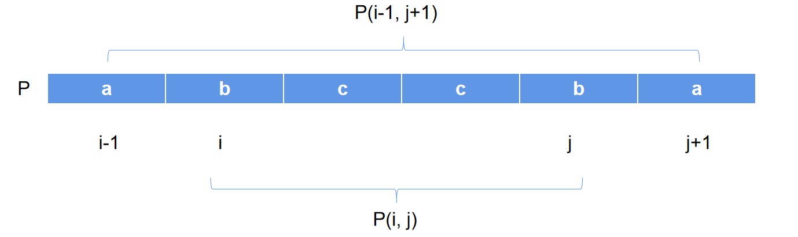
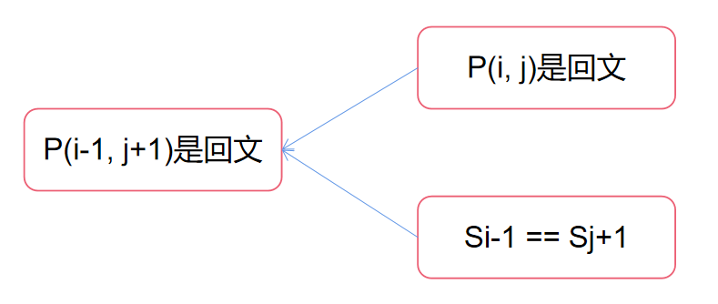
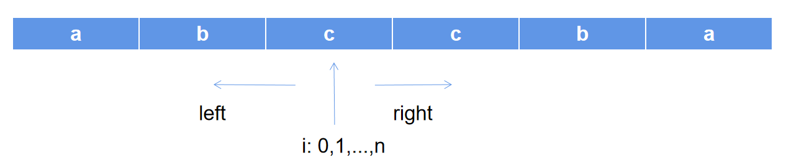
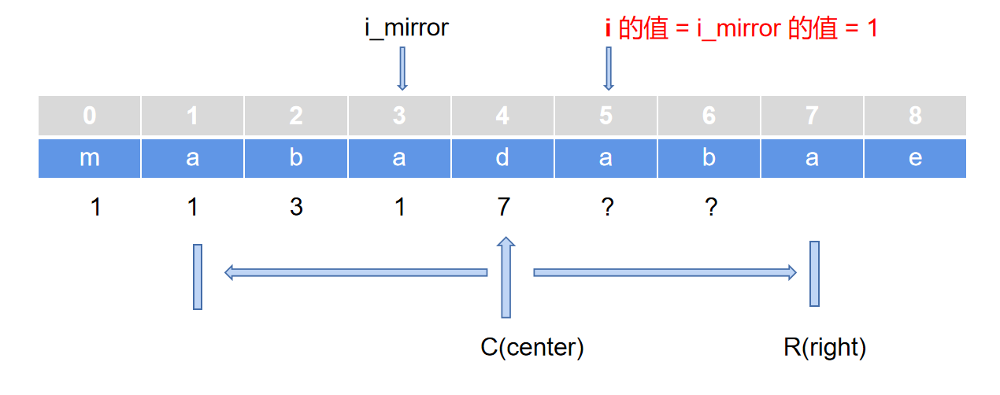
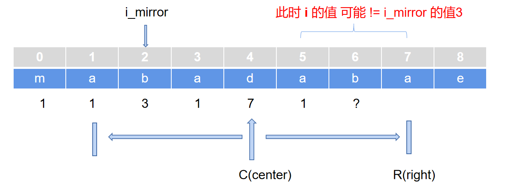
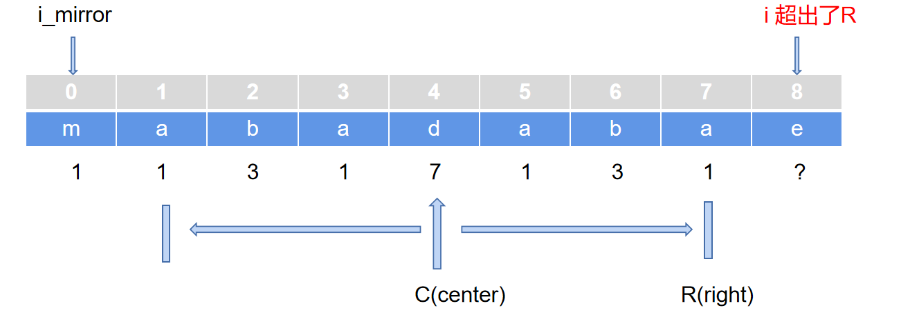
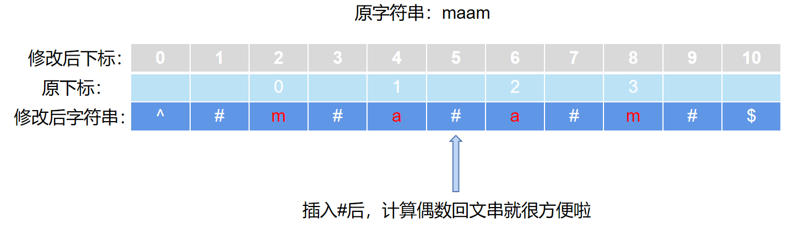

# 最长回文子串

[[toc]]

## 题目描述
给定一个字符串 s，找到 s 中最长的回文子串。你可以假设 s 的最大长度为 1000。

示例 1:
- 输入: "babad"
- 输出: "bab"
- 注意: "aba" 也是一个有效答案。

示例 2:
- 输入: "cbbd"
- 输出: "bb"

## 解题思路

### 1. 暴力法

这个很简单，就是先找到所有子串，然后用双指针法判断是否是回文。时空复杂度O(n<sup>3</sup>)、O(1)

### 2. 动态规划

首先我们知道如果已知`P(i, j)`是回文串，那么如果S<sub>i-1</sub>等于S<sub>j+1</sub>，则`P(i-1,j+1)`也是回文串。



那么递推公式如下：



所以我们可以先算出只有1个字符（和2个字符）的回文序列，然后根据这个公式一步步求解最长回文子串。时空复杂度为：O(n<sup>2</sup>)、O(n<sup>2</sup>)。（*空间复杂度优化后可以达O(n)*）

### 3.中心扩展法

根据回文串的对称特性，可以循环遍历一次字符串，对每个字符（以及每一对相同字符）进行中心扩展找最大回文序列。时空复杂度为：O(n<sup>2</sup>)、O(1)。



### 4.马拉车算法

这是一个非常巧妙的算法，它将时间复杂度优化到了O(n)级别。它的核心非常好理解：利用已经扫描过的已知信息来判断未来的子串长度。看下图即可明白：



假设前面已经找到了一个较长的公共子串`abadaba`，它的中心点center是4号字符d，它的右边界right是7号字符a，那么我想知道d右边的5号字符a为中心的最大回文长度，就可以根据回文串的对称性，就可以得出它等于左边的对称点3号的最大回文长度1。

但是也有一些意外情况发生：



当继续求6号字符b的的最大回文长度（先记为T[6]）时，首先假设T[6]等于3。但是由于此时6号回文的右边界已经和C点的右边界重合了，而更右边的8号的情况是未知的，因此无法判断P[8]是否等于P[4]，所以此时还需要用中心扩展法继续找6号的最大回文长度。

还有一种可能，就是当前点i，已经超过了R，此时就只能从1开始找最大回文长度了。



另外，对于偶数长度的回文串，由于回文中心不在字符串的字符上（在两个字符之间），计算他们的T值（最大回文长度）比较困难。马拉车算法对字符串进行了改造，使其既能求奇数长度的回文串，也能求偶数长度的回文串：



就是在每两个字符间插入#（其他字符也可以，只要不和原字符串重复就行），然后在前后分别插入^和$（其他字符亦可）（这2个字符是为了防止数组越界而设置的，不设置也可以，代码中多写几个判断即可）。这样，计算偶数长度的回文串，就可以以#为中心了。

以上就是马拉车算法，你get到了吗？

## 代码实现

### 中心扩展法
```javascript
var longestPalindrome2 = function (s) {
    let cIndex = 0, maxLen = 1;
    for (let i = 0; i < s.length; i++) {
        // 考虑奇数
        let l = i - 1, r = i + 1, len = 1
        while (r < s.length && l >= 0 && s.charAt(l) == s.charAt(r)) {
            l--
            r++
            len+=2
        }
        if (maxLen < len) {
            maxLen = len
            cIndex = l+1
        }
        if (s.charAt(i) == s.charAt(i+1)) {
            // 考虑偶数
            let l = i - 1, r = i + 2, len = 2
            while (r < s.length && l >= 0 && s.charAt(l) == s.charAt(r)) {
                l--
                r++
                len+=2
            }
            if (maxLen < len) {
                maxLen = len
                cIndex = l+1
            }
        }
    }
    return s.substr(cIndex, maxLen)
}
```

### 马拉车算法
```javascript
/**
 * 辅助函数：计算中心扩展计算i点长度
 * @param {*} P 
 * @param {*} i 
 * @param {*} originLen 
 */
function getLen(P, i, originLen) {
    let l = i - originLen, r = i + originLen, len = originLen
    while (P[l] == P[r] && r < P.length && l >= 0) {
        if (P[l] !== '#') {
            len += 2
        }
        l--
        r++
    }
    return len
}

/**
 * 马拉车算法
 * @param {string} s
 * @return {string}
 */
var longestPalindrome = function (s) {
    // P数组保存重构后的字符串
    let P = ['^', '#']
    for (let i = 0; i < s.length; i++) {
        P.push(s.charAt(i), '#')
    }
    P.push('$')
    // T数组保存每个字符为中心的最大回文长度
    let T = Array.from({ length: s.length * 2 + 3 }, () => 0)
    // 定义中心点C和他的右侧半径的点R
    let C = 2, R = 0
    // 开始计算T的值
    let maxLenIndex = 2, maxLen = 1;
    P.forEach((str, i) => {
        // ^$不用计算，就是0
        if (str === '^' || str === '&') {
            T[i] = 0
        } else {
            // 如果当前点i超过了R，进行中心扩展
            // 以及对称点为0，也进行扩展
            let i_m = C - (i - C)// 找到对称点
            let len_m = T[i_m]
            if (i + len_m < R) {
                // i点的右边界小于R,此时直接可以知道T[i]=T[i_m]
                T[i] = len_m
            } else {
                let originLen, len
                // 开始进行扩展
                if (i < R && i + len_m >= R) {
                    // i在R内部，但是i的右边界在外部，那么直接从R-i处开始扩展
                    originLen = R - i
                } else {
                    // i在外部，从头开始扩展
                    // 对'#'来说，长度应该从0开始
                    originLen = P[i] === '#' ? 0 : 1
                }
                len = getLen(P, i, originLen)
                T[i] = len;
                [C, R] = [i, i + len]
            }
        }
        // 保存最大子串的下标
        if (maxLen < T[i]) {
            maxLen = T[i]
            maxLenIndex = i
        }
    });
    // -1以后变成偶数，除以2时正好得到半径
    maxLen -= 1
    // 先找到P数组中左右index
    let left = maxLenIndex - maxLen
    let right = maxLenIndex + maxLen
    // 再计算真实的左右指针
    left = (left - 2) / 2
    right = (right - 2) / 2
    return s.substring(left, right + 1)
};
```