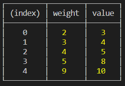
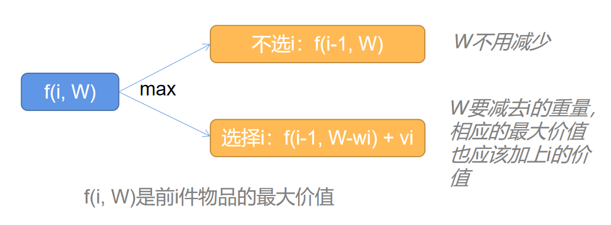

# 动态规划之01背包

[[toc]]

## 题目描述
有`n`种物品和一个容量为`W`的背包，第`i`种物品的重量是`wi`，价值是`vi`。求解将哪些物品装入背包可使这些物品的重量总和不超过背包容量，且价值总和最大。

比如如下物品(每个物品的信息为[w, v])：[[2, 3], [3,4], [4,5], [5,8], [9,10]]，背包容量为`W` = 20，如图:



当选择第0,2,3,4的物品时价值最大，为26，总重量是20。

## 解题思路1
一般有2种思路：
1. 要想把背包尽量装满，那么就应该优先选择更大重量的物品；
2. 要想获得最大价值，那么就应该优先选择价值更高的物品。

但是这2种思路都只考虑了重量或者价值一种因素，导致无法取得最优解，即不超过W的最大重量下的最大价值。

如何既考虑重量，又考虑价值，这时候就需要用到动态规划，我们先看如下例子：

假设只有1件物品（第0件）可以放入背包，那么我们知道有2种可能性：

|选择|重量|价值|
|----|----|---|
|pick|2|3|
|not pick|0|0|

结合背包的大小，我们有如下表格：
|W|0|1|2|3|...|20|
|-|-|-|-|-|---|--|
|选择物品0的价值|0|0|<i style="color:red">3</i>|3|...|3|

即根据背包的不同大小，最优解也在不断得变化，当W=2时，最优解为3.

假设现在有2件物品（第0和第1件）可以放入背包，那么在已知只有1件物品的最优解的情况下，第2件物品可以得到如下表格：

|W|0|1|2|3|4|5|6|...|20|
|-|-|-|-|-|-|-|-|---|--|
|选择物品0的价值|0|0|3|3|3|3|3|...|3|
|选择物品1的价值|0|0|3|<i style="color:red">4</i>|4|<i style="color:red">7</i>(4+3)|7|...|7|

可以看到，当背包的容量W=3的时候，我们可以选择不拿物品0，而是拿物品1，从而得到最大价值为4。
而当背包的容量W=5的时候，我们可以选择拿物品1和物品0，得到最大价值为7，后面的解类似。

通过这个例子可以得到什么结论呢？

我们在考虑背包问题的时候，可以先去思考比它的更小的那个问题。比方说，前i个物品的最大价值，为了方便，我们记做`f(i, W)`，意思就是背包容量为W的前i件商品的最大价值。这个问题我们可以分解为2个子问题：`f(i-1, W)`和`f(i-1, W - wi) + vi`。这2个问题是什么意思呢？就是f(i, W)的值有2种可能，一种是选择第i件物品，一种是不选。当选择i时，那他一定等价于前i-1件物品最大价值加上i件物品的价值，也就是`f(i-1, W - wi) + vi`；另一种是不选择第i件物品，那么他其实就等于前i-1件物品的最大价值，即`f(i-1, W)`。



根据这个公式，我们就可以把背包问题划分为一个个子问题，通过对子问题的求解来解决背包问题。这种一层层向下求解的方式，很容易就想到递归的方法。

## 递归解法
```javascript
// 思路1：递归
// 递归的公式是： f(i, w) = max(f(i-1, w), f(i-1, w - wi) + vi)
// 意思就是前i件（重w时）的最大价值等于二选一的更大值：
// 一是不选择i物品f(i-1, w), 二是选择i物品f(i-1, w - wi) + vi
// 当选择i物品时，重量超过了W，那么就只能放弃i，只能选择f(i-1, w)
function recur(W, products, i) {
  if (i === 0) {
    // 求解第0个物品时，即为递归的出口
    // 若物品0的重量超过W，那么最大价值为0，因为无法选择
    if (products[i] > W) return 0
    // 若不超过W，那么最大价值为v0
    return products[i].v
  } else {
    if (W - products[i].w < 0) {
      // 如果超重了，就不选，直接返回f(i-1, W)
      return recur(W, products, i - 1)
    } else {
      // 选择和不选择，比较哪个更优
      let pick = recur(W - products[i].w, products, i - 1) + products[i].v
      let notPick = recur(W, products, i - 1)
      return Math.max(pick, notPick)
    }
  }
}
```
## 解题思路2
递归有一个问题，当W和n很大时，递归的函数调用栈会非常长，可能会爆栈导致无法求解。而且递归时，容易产生重复子问题，此时没必要重复求解。因此我们可以考虑用数组来保存这些中间结果，数组的每一个格子都表示一个中间态的解。而这个数组，在前面解题思路1中，已经使用到了：

|W|0|1|2|3|4|5|6|7|8|9|10|...|20|
|-|-|-|-|-|-|-|-|-|-|-|--|---|--|
|选择物品0的价值|0|0|3|3|3|3|3|3|3|3|3|...|3|
|选择物品1的价值|0|0|3|4|4|7|7|7|7|7|7|...|7|
|选择物品2的价值|0|0|3|4|5|7|<i style="color:red">8</i>|9|9|12|12|...|12|

我们来关注第6列、物品2的那个格子。这里的8是怎么来的呢？也就是为什么`f(2, 6) = 8`。
根据上面分析的公式我们可以先计算`f(1, 6)`，即不选择物品2的最大值，这个看表格可以得到是`7`；然后我们计算`f(1, 6 - w2) + v2 = f(1, 2) + 5 = 8`。相比较之下8更大，因此这一格子可以填8，即前2个物品，背包的容量为6时，最大价值是8。

然后把这个表格填满:

|W  |0|1|2|3|4|5|6 |7 |8 |9 |10|11|12|13|14|15|16|17|18|19|20|
|-----|-|-|-|-|-|-|--|--|--|--|--|--|--|--|--|--|--|--|--|--|--|
|物品0|0|0|3|3|3|3|3 |3 |3 |3 |3 |3 |3 |3 |3 |3 |3 |3 |3 |3 |3 |
|物品1|0|0|3|4|4|7|7 |7 |7 |7 |7 |7 |7 |7 |7 |7 |7 |7 |7 |7 |7 |
|物品2|0|0|3|4|5|7|8 |9 |9 |12|12|12|12|12|12|12|12|12|12|12|12|
|物品3|0|0|3|4|5|8|8 |11|12|13|15|16|17|17|20|20|20|20|20|20|20|
|物品4|0|0|3|4|5|8|8 |11|12|13|15|16|17|17|20|20|21|22|23|25|26|

其中最后一个格子的值就是我们要求解的最大值：26

## 递推解法
```javascript
// 思路2：递推（循环）
// 递归的公式是： f(i, w) = max(f(i-1, w), f(i-1, w - wi) + vi)
// 把f(i, w)写成二维数组，从第一行开始填写这个二维数组即可解
function loop(W, products) {
  let n = products.length
  // f是计算当第i个物品和容量为W时的最大价值，i是行，W是列
  let f = Array.from({ length: n + 1 }, () => Array.from({ length: W + 1 }, () => 0))
  // 计算每一行的数据
  for (let i = 1; i <= n; i++) {
    for (let w = 0; w <= W; w++) {
      if (w < products[i - 1].w) {
        f[i][w] = f[i - 1][w]
      } else {
        let pick = f[i - 1][w - products[i - 1].w] + products[i - 1].v
        let notPick = f[i - 1][w]
        f[i][w] = Math.max(pick, notPick)
      }
    }
  }
  return f[n][W]
}
```
## 复杂度
1. **递归**是逐层分解子问题，一共有n个物品，因此其时间复杂度是O(n)，在最差情况下，空间复杂度是O(2<sup>n</sup>)，因为每次都要找2个子问题的解（有时为1个）。
2. **递推**的方法是通过一个二维数组来保存中间状态的解，循环n * W次，因此时间复杂度为O(n<sup>2</sup>)，空间复杂度也是O(n<sup>2</sup>)。

## 推荐
01背包问题有一个在线计算器，可以自动进行填表操作，十分方便：[在线背包问题计算器](https://misakasister.github.io/Online_0-1_Knapsack/index.html)