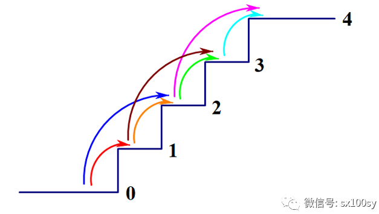
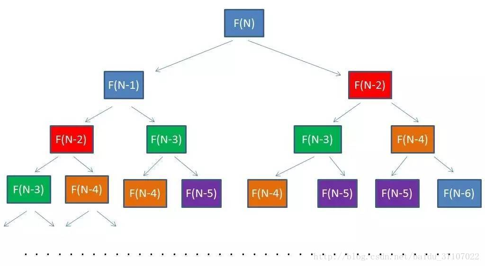
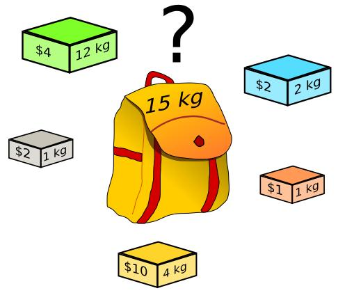
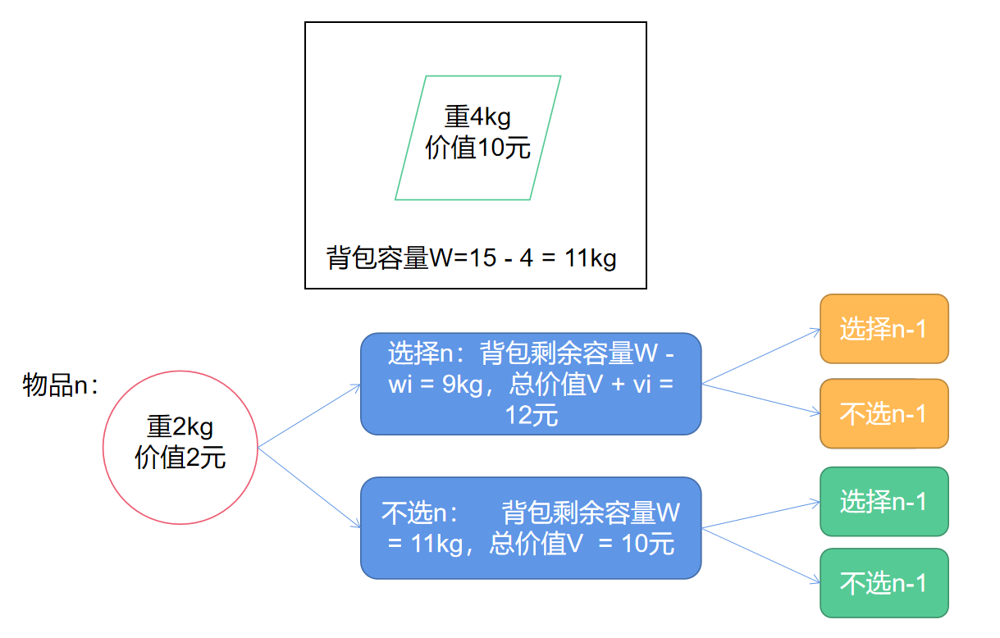
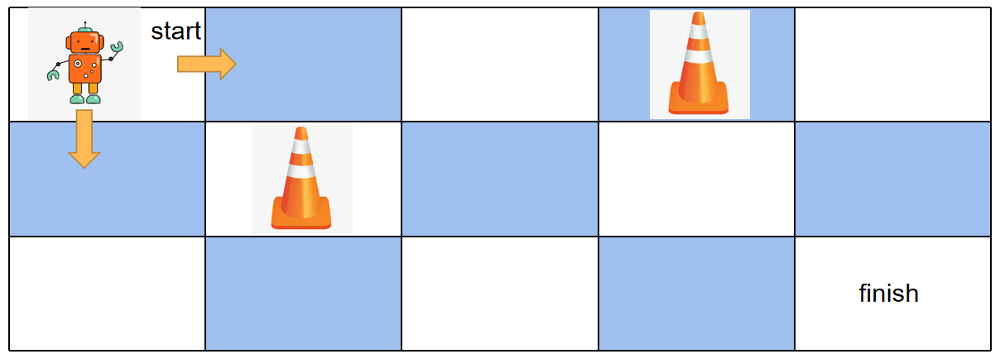
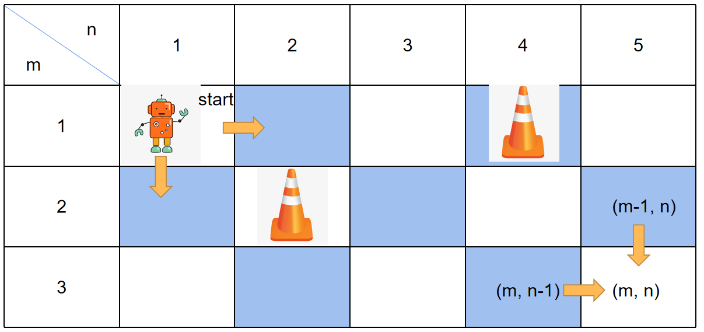
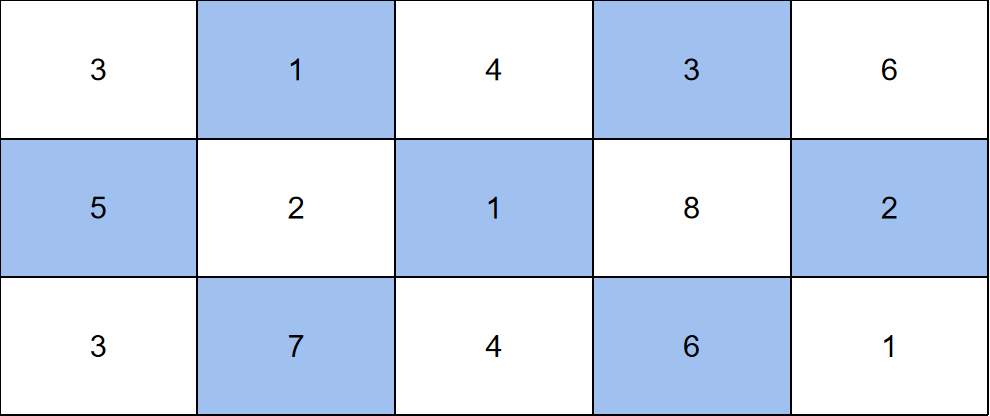
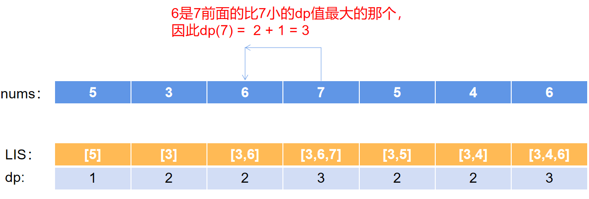
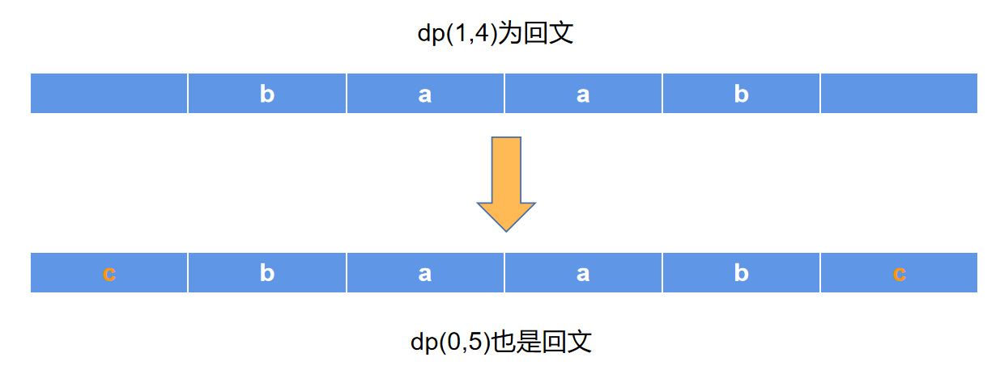

# 算法之动态规划总结


[[toc]]


## 定义
一个最优化问题可以被分解为子问题，子问题还可以再分解成更小的子问题，通过求解不断变化地子问题，来解决父问题的思想。

## 三个要素
1. 状态转移公式：就是找规律，如何通过子问题的解如何得到父问题的解
2. 最优子结构：子问题的最优解就是父问题的最优解
3. 边界：分解子问题不能无限循环，要可以在某个边界处直接得到答案

## 解决动态规划问题的三种方法
1. 简单递归
    - 通过状态转移公式就可以简单地转化为递归
2. 备忘录算法
    - 简单递归的升级版本，直接递归可能会产生很多重叠子问题，通过用哈希表保存已经计算过的子问题的解来减少计算量
3. 递推（迭代）
    - 递归是自顶向下解决问题，即先求解父问题，由父问题引出子问题，再求解子问题，然后不停向下寻找答案。
    - 递推是自底向上，即从边界开始求出所有子问题的解，再一步步向上求解父问题。
    
## 问题和思路

### 1. 走楼梯问题
- 问题描述

假设你正在爬楼梯。需要 n 阶你才能到达楼顶。每次你可以爬 1 或 2 个台阶。你有多少种不同的方法可以爬到楼顶呢？ 


*图片来自网络，侵删*

- 思路

这个问题和计算斐波那契数类似，假设到n阶所用方法数为`F(n)`。由常理，走到n级台阶，必须通过n-1级台阶走一步或者n-2级台阶走两步。因此当我们知道`F(n-2)`和`F(n-1)`的解时，可以得到F(n)的解：`F(n)=F(n-2)+F(n-1)`，这个就是状态转移公式。它的边界是`F(1)=1`以及`F(2)=2`



*图片来自网络，侵删*

### 2. 01背包问题
- 问题描述

小偷准备偷东西，他有一个容量为W的背包，有n个物品可以偷，每个物品的重量为wi，价值为vi。问如何选择物品可以使偷到的总价值最大（背包不一定要装满，每个物品不能重复偷）。



*图片来自网络，侵删*

- 思路

假设偷n个物品的最大价值为`V(n, W)`，偷n-1件物品的最大价值`V(n-1, W)`（W是指背包剩余的容量），那么这两种之间有2种可能：
1. 偷第n件物品，则状态转移公式为：`V(n, W) = V(n-1, W - wn) + vn`；
2. 不偷第n件物品，则状态转移公式为：`V(n, W) = V(n-1, W)`。

要注意的是不偷某件物品是为了空出空间去偷其他的物品，因此这2种情况都需要考虑，所以`V(n, W)`等于`V(n-1, W) + vn`和`V(n-1, W)`的最大值。问题的边界是V(1)的解。



### 3. 机器人走网格问题（不同路径）
- 问题描述

一个机器人位于一个 m x n 网格的左上角 （起始点在下图中标记为“Start” ）。机器人每次只能向下或者向右移动一步。机器人试图达到网格的右下角（在下图中标记为“Finish”）。考虑网格中有障碍物。那么从左上角到右下角将会有多少条不同的路径？



- 思路

想要求得机器人到达右下角的路径，因为要到达右下角`(m, n)`必然经过`(m-1, n)`格子和`(m, n-1)`格子，假设到达`(i, j)`所有路径为`dp(i, j)`， 那么状态转移公式为：`dp(i, j) = dp(i-1, j) + dp(i, j-1)`。边界为`dp(0)=1`。
因为要考虑障碍物，所以判断条件会多一点，如`grid(x, y)`格子有障碍物时，则其dp值为0，因为此路不通。



### 4. 最小路径和
- 问题描述

给定一个包含非负整数的 m x n 网格，请找出一条从左上角到右下角的路径，使得路径上的数字总和为最小。
说明：每次只能向下或者向右移动一步。



- 思路

这题和机器人走网格有点像，不同的是这题是找一条路径和最小的路。所以想找到`dp(i, j)`最小值，只需要求得左边格子dp和上面格子dp的较小值，然后和当前格子的grid相加即可。因此状态转移公式是：`dp(i, j) = min( dp(i-1, j), dp(i, j-1) ) + grid(i, j)`

### 5. 三角形最小路径和
- 问题描述

给定一个三角形，找出自顶向下的最小路径和。每一步只能移动到下一行中相邻的结点上。

例如，给定三角形：
```javascript
[
     [2],
    [3,4],
   [6,5,7],
  [4,1,8,3]
]
```
自顶向下的最小路径和为 11（即，2 + 3 + 5 + 1 = 11）。

- 思路

可以自顶向下求出每一行的最小路径，亦可以自底向上求出每一行的最小路径。假设`dp[i, j]`表示第i行j列的最小路径，则基本的状态转移公式是：`dp[i, j] = min( dp[i-1, j-1], dp[i-1, j] )`（自顶向下），或者是`dp[i, j] = min( dp[i+1, j], dp[i+1, j+1] )`（自底向上）。边界是顶层的三角形数组的值。

> 要注意的是如果自底向上写代码，会简单一些，且更快。因为省去了一些边界值的判断，同时也无需在最后一次找到dp数组的最大值。

### 6. 零钱兑换
- 问题描述

给定不同面额的硬币 coins 和一个总金额 amount。编写一个函数来计算可以凑成总金额所需的最少的硬币个数。如果没有任何一种硬币组合能组成总金额，返回 -1。

示例：输入coins = [1, 2, 5], amount = 11。输出：3。解释： 11 = 5 + 5 + 1

说明:
你可以认为每种硬币的数量是无限的。

- 思路

根据总金额11和零钱的面额1,2,5，可以得到问题（凑成11的所需最少的硬币数量）`dp(11)`的子问题：
1. 凑成10所需的最少的硬币数量`dp(10) + 1`
2. 凑成9所需的最少的硬币数量`dp(9) + 1`
3. 凑成6所需的最少的硬币数量`dp(6) + 1`

找到这3个问题的解，求出其中的最小值，就可以得到dp(11)的解。因此状态转移公式是：`dp(n) = min( dp(n - coins[0]) + 1, dp(n - coins[1]) + 1, ... dp(n - coins[m]) + 1 )`(m表示硬币面额数量)。问题的边界是：`dp(1) = 1`，`dp(2) = 1`，`dp(5) = 1`以及`dp(k) = 0`(k <= 0)

### 7. 最长上升子序列
- 问题描述
给定一个无序的整数数组，找到其中最长上升子序列的长度。如`[10,9,2,5,3,7,101,18]`，它的最长上升子序列是`[2,3,7,101]`，长度为4.

- 思路

重新定义问题，假设问题`dp(i)`表示如序列长度为i，且选择第i个数为子序列的最后一个数时，最长子序列的长度。简单来说，就是必须选择第i个数，求出前i个数的子序列的长度。此时`dp(i)`的值就不一定和`dp(i-1)`有关系了，而是和之前的某一个数k有关，而这个k就是所有比第i个数小的那个数中dp值最大的一个。请看图：



当我们找到第k个数时，即`dp(k)`，将它加一，就可以得到`dp(i)`的值。因此状态转移公式是：`dp(i) = dp(k) + 1`(k是所有比第i个数小的那个数中dp值最大的那个)。边界是`dp(0) = 1`。

### 8. 最长回文子串
- 问题描述

给定一个字符串 s，找到 s 中最长的回文子串。你可以假设 s 的最大长度为 1000。输入："babad"，输出："bab"或"aba"

- 思路

根据回文的对称性，我们知道，当一个字符串为回文时，那么如果在字符串的两边拼接上相同的字符，得到的字符串依然是回文。因此本题的问题为：若`dp(i, j)`为回文字符串，
1. 当`s[i-1]==s[j+1]`时，`dp(i-1, j+1) = dp(i, j) + 1`；
2. 当`s[i-1]!=s[j+1]`时，`dp(i-1, j+1) = dp(i, j)`。

通过找到最小长度（1和2）的所有回文子串，一步步地找到最长的回文串，即可求解本题。



> 本题还有中心扩展法以及更加精妙的马拉车算法，有兴趣的同学可以去看一下。