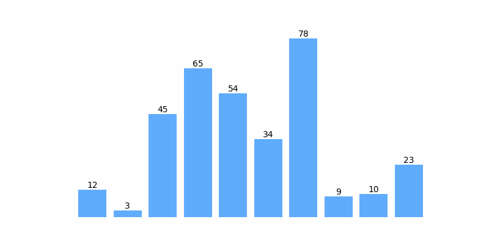
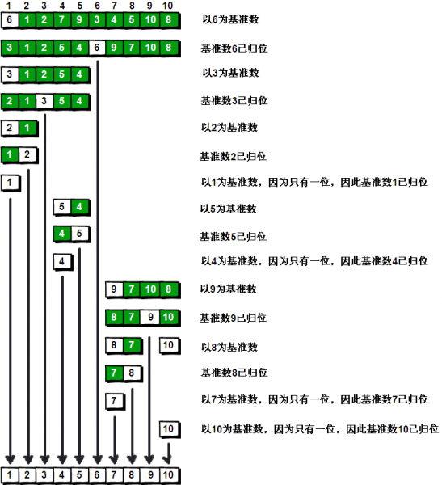
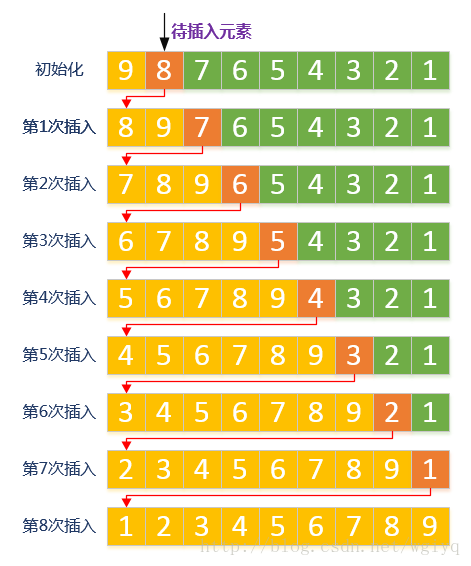
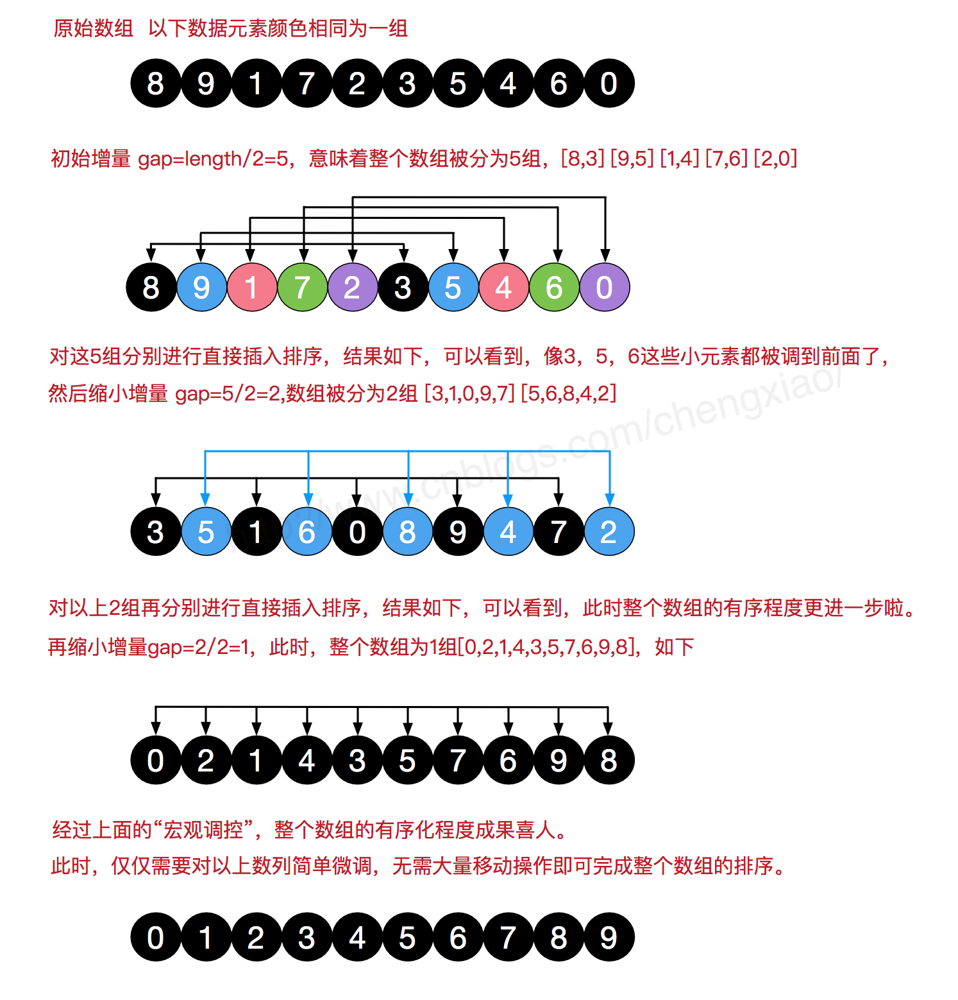
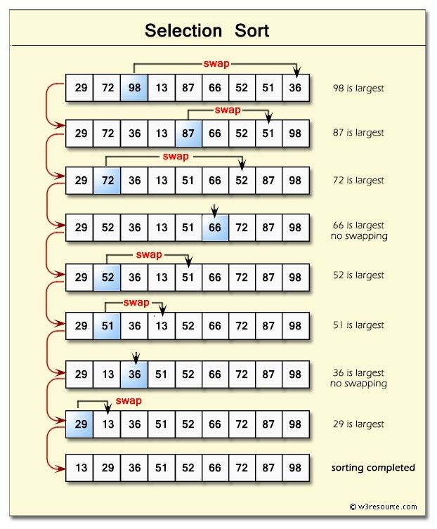
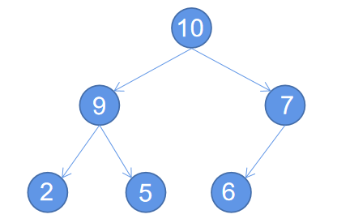
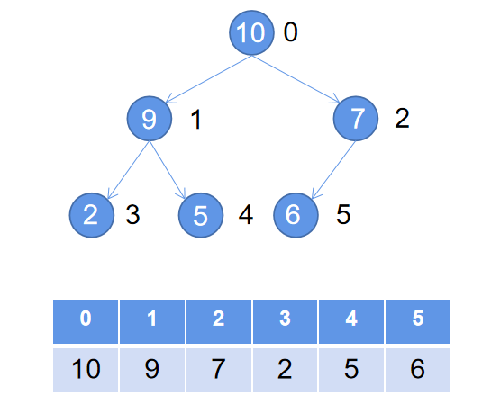
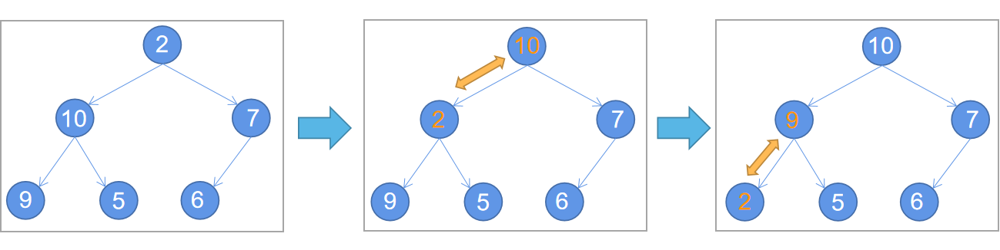

# 算法之排序总结


[[toc]]

温度而知新，对于学习过的知识，要经常回顾和使用，才能记得更牢。今天就把几种经典的排序算法总结一下。

::: tip 本文的几个规则
1. 为了方便起见，我把排序的规则都设置为升序排序，即从小到大排列。
2. 要排序的数组长度规定为`n`。
3. 堆定义为大顶堆。这样在进行堆排序时即为升序排列。
:::

## 冒泡排序

冒泡的基本思想就是通过遍历数组，对**相邻的两个元素**比较大小，大的元素交换到后面去。每次遍历后，**最大的那个元素一定排到了末尾**，经过`n`次遍历，整个数组就排序完成了。



图片来自：[排序算法知多少](https://www.smslit.top/2018/11/07/algorithm-sort/)，若侵权可删除

冒泡的缺点是效率很低，每趟排序都要进行最多n次比较，交换的次数太多了。优点是当你做题时，忘记所有排序算法的时候，你可能想起的算法就是它了，因为它足够简单，哈哈哈。

js代码实现如下：
```javascript
/**
 * 简单版本冒泡
 * @param {Array} nums 
 * leetcode时间：6132ms
 */
function bubbleSort(nums) {
    let len = nums.length
    for (let i = 0; i < len - 1; i++) {
        for (let j = 0; j < len - i - 1; j++) {
            if (nums[j] > nums[j+1]) {
                [nums[j], nums[j+1]] = [nums[j+1], nums[j]]
            }
        }
    }
    return nums
}

/**
 * 优化版本冒泡
 * 如果一轮排序下来，没有发生交换，则认为排序已经完成
 * leetcode时间：7168ms
 * @param {Array} nums 
 */
function bubbleSort(nums) {
    let len = nums.length
    let isSorted = true
    for (let i = 0; i < len - 1; i++) {
        for (let j = 0; j < len - i - 1; j++) {
            if (nums[j] > nums[j+1]) {
                [nums[j], nums[j+1]] = [nums[j+1], nums[j]]
                isSorted && (isSorted = false)
            }
        }
        if (isSorted) return nums
        isSorted = true
    }
    return nums
}
```

## 快速排序

先介绍快速排序的原因是，快排是改进版本的冒泡排序，也是通过比较和交换完成一轮排序，只不过快排的效率比冒泡要高得多，需要排序的轮数也少得多。

快排的基本思想是：每一轮排序，**选定一个基准值`pivot`**，把每个比`pivot`小的元素放到`pivot`前面，把每个比`pivot`大的元素放到`pivot`后面，这样一轮下来，数组就变成了3部分，即`pivot`左边的元素、`pivot`和`pivot`右边的元素，接着递归地对左边的元素们和右边的元素们进行快排即可。当每组需要排序的数量为1或0时，就没必要进行排序了，此时排序完成。

由于每一趟排序都会将整个数组一分为二（`pivot`只有1个，不考虑它），因此只需要log<sub>2</sub>n趟排序即可完成，每趟排序扫描整个数组，因此**平均时间复杂度**为O(nlog<sub>2</sub>n)。由于是原地排序，以及使用了递归，因此**空间复杂度**是O(log<sub>2</sub>n)。

下图比较清晰明了地展示了快排的思想：



图片来自：[算法 3：最常用的排序——快速排序](https://wiki.jikexueyuan.com/project/easy-learn-algorithm/fast-sort.html)，若侵权可删除

::: tip 基准值pivot的选取
1. 最简单的做法是取首位元素，但是这种方法有可能遇到像[5,4,3,2,1]这种倒序排列的数组，此时快排就退化到了冒泡排序，时间复杂度为O(n<sup>2</sup>)。

2. 另一种做法是取数组中的随机一个值，这样碰到上述情况的可能极小，因此比较推荐这种做法。

3. 最后是中位数的中位数法(`BFPRT算法`)，简单说就是每一轮把数组分成n / 5组，每组进行插入排序，然后找到每组的中位数；下一轮继续将中位数分为 n/5 / 5组，然后继续找到中位数；一直到最后一组的中位数，这个数即作为pivot。这种方法的好处是能够保证每趟快排，至少能将整个数组进行3:7的划分成2个子数组，具体的证明可以看蒟蒻大佬的这篇博文：[【蒟蒻算法】从快速排序到快速选择-BFPRT](https://www.jvruo.com/archives/639/)
:::

**原地快速排序有2种方法：填坑法和双指针交换法**，其中双指针交换法效率更高。

首先看**填坑法**，它的思想是先把`pivot`的值缓存，然后这个位置就变成了一个“坑”，设置L和R两个指针，R先从右向左扫描数组，遇到比`pivot`小的数就把这个数填到左边的“坑”中，然后这个数本身的位置变成一个新的“坑”（右边）；接着L指针从左向右扫描找比`pivot`大的数，然后把这个数填到右边的“坑”中。如此一趟排序下来，小的数自然就到了左边，大的数就到了右边，最终L和R指针相遇的点就是最终的“坑”，把之前缓存的`pivot`填进去即完成了一趟排序。代码如下：
```javascript
/**
 * 快速排序-填坑法递归
 * 基准值选取第一个元素
 * 100ms 97%
 * @param {Array} nums 
 */
function quickSort(nums) {
    return partition(nums, 0, nums.length - 1)
}
function partition(nums, L, R) {
    if (R - L <= 0) return nums
    // 保存最初的L和R
    let left = L, right = R
    // keyIndex就是坑位，设置为最左边的元素（即pivot），并且缓存坑的数值
    let keyIndex = L++, key = nums[keyIndex]
    while(L <= R) {
        // 从right指针开始找比key小的数
        while (nums[R] >= key) R--
        if (L <= R) {
            // R填到左边的坑
            nums[keyIndex] = nums[R]
            // 更新坑位
            keyIndex = R--
        } else {
            break
        }
        // 接着从left指针开始找比key大的数
        while (nums[L] <= key) L++
        if (L <= R) {
            // L填到右边的坑
            nums[keyIndex] = nums[L]
            // 更新坑位
            keyIndex = L++
        }
    }
    // L和R汇合了，把缓存的key填到最新的坑位
    nums[keyIndex] = key
    // 然后递归调用partition进行下一趟排序
    partition(nums, left, keyIndex - 1)
    partition(nums, keyIndex + 1, right)
    return nums
}
```

**双指针交换法**的思想也很好理解：设置L和R两个指针，同样是R从右往左扫描，但是找到比pivot小的数就停下，先不操作；然后L从左向右扫描，找到比pivot大的数，此时将L和R对应的数交换；然后继续重复上述过程直到L和R相遇。这样在一趟排序下来，小的数就被换到了左边，大的数换到了右边。代码实现如下：
```javascript
/**
 * 快速排序-双指针法递归
 * 基准值选取随机元素
 * 100ms 97%
 * @param {Array} nums 
 */
function quickSort(nums) {
    return partition(nums, 0, nums.length - 1)
}
function partition(nums, L, R) {
    if (R - L <= 0) return nums
    // 随机选取pivot
    let randomIndex = Math.floor(Math.random() * (R - L + 1)) + L;
    // 为了方便，把pivot交换到第一个
    [nums[L], nums[randomIndex]] = [nums[randomIndex], nums[L]]

    let pivot = left = L, right = R

    while(L < R) {
        // R从右向左，找到比基准值小的数
        while (nums[R] >= nums[pivot] && L < R) R--
        // L从左向右，找到比基准值大的数
        while (nums[L] <= nums[pivot] && L < R) L++
        if (L < R) {
            // 交换这两个数
            [nums[L], nums[R]] = [nums[R], nums[L]]
        }
    }
    // L和R汇合了，把基准值和左边数组的最后一个数交换
    // 如果基准值比所有值都小，那么不用交换
    if (R !== pivot) {
        [nums[pivot], nums[R]] = [nums[R], nums[pivot]]
    }
    // 然后递归调用partition
    partition(nums, left, R - 1)
    partition(nums, R + 1, right)
    return nums
}
```
快速排序也可以不用递归，而是用栈来进行迭代，有兴趣可以试一下。

## 插入排序

插入排序的思想和打扑克牌相似，当我手上已经抓了3,4,5,7这四张牌时，又抓了一张6，那么我会直接把6这张牌直接插入到5和7之间，这就是插入排序。

插入排序的图示看下面：



图片来自：[插入排序—直接插入排序(Straight Insertion Sort)](https://blog.csdn.net/wgiyq/article/details/54175713)，若侵权可删除

思路：首先把第一个元素认作是已排好序的数组，从i=1开始排序，首先把当前值保存到insert变量，然后从后向前找，如果比insert大，把这个数向后复制，如果比insert小，说明找到了insert应该插入的位置，把insert插入进去。此时一趟排序就完成了，左边的有序数组长度加1；然后下一趟将下一个数插入到左边的有序数组中。直到最后一个数插完为止。

插入排序的平均时间复杂度为O(n<sup>2</sup>)，因为每趟排序最差都要比较和复制最多i次。而当n的数量较少，或者数组已经几乎排好序时，插入排序的效率是很高的。代码如下：
```javascript
/**
 * 插入排序
 * leetcode: 1120ms
 * @param {Array} nums 
 */
function insertSort(nums) {
    let len = nums.length
    // 从1开始排序，认为前面的0已经排好序了
    for (let i = 1; i < len; i++) {
        // 保存当前要插入到有序数组的数
        let insert = nums[i]
        for (let j = i - 1; j >= 0; j--) {
            // 有序数组中从后往前找比insert大的数，找到了就把当前的数复制到下一个
            if (nums[j] > insert) {
                nums[j+1] = nums[j]
                // 如果一直找到第一个，直接插入
                if (j === 0) nums[j] = insert
            } 
            // 找不到就把insert插入进去
            else {
                nums[j+1] = insert
                break
            }
        }
    }
    return nums
}
```
 
## 希尔排序

普通插入排序在数组倒序或者比较混乱的情况下，其效率是很低的，需要做很多次地比较和复制操作，但是如果一个数组是已经几乎排好序的，那么插入排序效率会很高。因此希尔排序就利用这个思想，首先对一个数组进行**预处理**，让数组变得几乎有序，最后再进行普通的插入排序进行排序。

对数组的**预处理**很简单，就是先将数组拆分成n/2组，对每一组进行普通插入排序，由于每组内的元素很少，因此排序速度很快。这样一趟下来，数据的有序化程度就会提高；接着把数组拆分成n / 4组，继续对每组进行排序；重复上述步骤直到最后只剩下一组，然后进行普通插入排序，即可完成最后的排序。图示如下：



图片来自：[图解排序算法(二)之希尔排序](https://www.cnblogs.com/chengxiao/p/6104371.html)，若侵权可删除

代码如下：
```javascript
/**
 * 原始希尔排序（二分增量）
 * 插入排序的改进版
 * 先分k组进行插入排序，然后再分k/2组排序，最后只分1组进行插入排序
 * 这样做的原因是可以减少比较和移动的操作
 * 增量为len/2, len/4, ... , 1
 * leetcode时间：100ms，超过97%
 * @param {Array} nums 
 */
function shellSort(nums) {
  let len = nums.length
  if (len <= 1) return nums
  // 增量设为k
  let k = len
  while(k > 1) {
    // 增量每次除以2
    k = Math.ceil(k / 2)
    // 分成k组进行排序
    for (let i = 0; i < k; i++) {
      // 每一组从i开始，每一个元素是i，i+k，i+2k，i+3k，...，i + nk，
      // 现在开始简单插入排序
      for (let j = i + k; j < len; j += k) {
        // 前面的i到j已经排好序，因此从j - k开始从后往前遍历
        let insert = nums[j]
        for (let t = j - k; t >= i; t -= k) {
          if (nums[t] > insert) {
            // 当前数大于insert，则把当前数复制给下一个
            nums[t+k] = nums[t]
            // 当前t已经走到开头了，那么把insert插入到头
            if (t === i) nums[t] = insert
          } else {
            // 当前数不大于insert，说明找到应该插入的地方了，
            // 则把insert插入到t+k，然后退出
            nums[t+k] = insert
            break
          }
        }
      }
    }
  }
  return nums
}
```
::: tip 希尔增量
希尔排序每次将数组拆分为n/2, n/4, n/8, ... , 1的分组的变量称为**希尔增量**，在一般情况下，使用这种朴素的希尔增量就够了，但是有时也会碰到一些特殊情况，导致在分组时没有做任何交换，导致白白地进行了多次扫描。为了避免这种情况，可以将希尔增量设置为`k = 2 ^ t - 1`，称为Hibbard增量，它的平均时间复杂度约为O(N<sup>5/4</sup>)；或者Sedgewick增量：`k = 9 * 4 ^ t - 9 * 2 ^ t + 1`，它的平均时间复杂度约为O(N<sup>7/6</sup>)
:::

## 选择排序
选择排序是一种简单的排序算法，它的基本思想是：每一趟遍历都找到当前数组中最大的那个数，最后将最大数和当前数组的最后一位交换；每一趟遍历的元素个数减一。由于要遍历n次，每次遍历n-i个，因此选择排序的时间复杂度为O(n<sup>2</sup>)。下面是选择排序的图示：


图片来自：[前端算法之——选择排序（Selection sort）](https://zhuanlan.zhihu.com/p/42749670)，若侵权可删除

选择排序的代码如下：
```javascript
/**
 * 选择排序
 * leetcode: 1528ms
 * @param {Array} nums 
 */
function selectionSort(nums) {
    let len = nums.length
    if (len <= 1) return nums

    for (let i = len - 1; i >= 0; i--) {
        let max = -Number.MAX_VALUE, index = 0
        let j = 0
        for (; j < i + 1; j++) {
            if (max < nums[j]) {
                max = nums[j]
                index = j
            }
        }
        index !== --j && ([nums[index], nums[j]] = [nums[j], nums[index]]) 
    }
    return nums
}
```

## 堆排序
要说堆排序，首先要说一下`完全二叉树`这个数据结构。`完全二叉树`的概念来源于`满二叉树`，`满二叉树`即一个二叉树的每一层节点都是“满”的，不存在某一个节点缺枝少叶的情况。而`完全二叉树`要求不那么严格，它要求除了最底层，其他层也都是“满”的，而且最底层的节点，也必须从左到右排列，不允许中间出现空位，如图：



完全二叉树有一个特点，就是可以把树写成数组的形式，我们可以将树进行编号，对于它的每一个节点i，它的左子节点编号一定是`left = 2 * i + 1`，它的右子节点编号一定是`right = 2 * i + 2`，而它的父节点编号一定是`parent = (i - 1) / 2`（取整数）。不信的话可以参考下图算一下试试：



最后说到堆，堆就是满足如下性质的完全二叉树：任一节点的值都大于其左子节点以及其右子节点的值。上面的图其实就是一个堆了。

那么堆排序是怎么做呢？首先我们把一个数组用某种方式（名为`buildHeap`）构建出一个堆，那么**堆顶的那个元素一定是数组的最大值**，此时将堆顶的元素“删除”（不是真的删除，只是把堆顶元素和末尾元素互换，然后把堆的长度减一），而后进行一次堆的维护操作（就是将一个完全二叉树重新变成一个堆，名为`heapify`），此时堆顶的元素就是整个数组的次大值，接着继续“删除”这个元素（和堆尾元素互换，堆长度减一）；重复n次上述操作，最终的数组就是排好序的，因为最大的元素排到最后面去了，最小的元素留在最前面。

接下来是重点了，如何进行堆的维护操作（`heapify`）？首先，根据堆的定义，父元素一定要大于子元素，因此对于某一个节点，我们只需要对比它和它的两个子元素的大小。若该节点大于2个子节点，则当前节点和子节点组成的树就是一个满足要求的堆，无需移动；**如果该节点小于某个子节点，那么就找到最大的那个子节点，和父节点交换值**，此时这3个节点也就满足堆的定义了，但是要注意的是，一旦树的结构进行了变化，那么子元素的子树也可能不满足堆的定义，因此要递归地对交换了节点的子节点继续进行`heapify`。下图可以看到`heapify`的操作步骤：



堆排序的第一步是构建一个堆（`buildHeap`），如何构建一个堆呢？可以先从简单的情况进行考虑，如当前的数组只有3个元素，那么他们组成的二叉树只需要一次`heapify`操作，就可以将这个数组构建成一个堆了。接着如果再增加3个元素，那么就和之前举的例子一样了，他们构成的二叉树实际上包含了3个子树，如果我们从底向上进行`heapify`操作，就是先`heapify`下面的2个子树，那么下面的2个子树就是满足要求的堆，然后再对上面的子树进行`heapify`操作，就可以将整个数组都变成堆了（因为`heapify`操作是递归的，对于下一层的子树，也会继续进行`heapify`操作）。因此我们可以知道**构建堆的方法：对每一个树的非叶子节点，自底向上遍历进行heapify操作**。

下面是堆排序的js代码实现：
```javascript
/**
 * 维护堆
 * 将一个完全二叉数的第i个元素向下转换成最大堆
 * @param {Array} nums 二叉树数组
 * @param {number} i 当前要转换的节点
 * @param {number} n 数组的长度
 */
function heapify(nums, i, n) {
    // 左子节点
    let left = 2 * i + 1
    // 右子节点
    let right = 2 * i + 2

    // 找到当前节点、左子节点、右子节点的最大的那个
    let maxIndex = i
    if (left < n && nums[left] > nums[maxIndex]) {
        maxIndex = left
    }
    if (right < n && nums[right] > nums[maxIndex]) {
        maxIndex = right
    }
    // 如果左或右比当前大，那么交换当前节点和左节点（右节点）
    if (maxIndex !== i) {
        [nums[maxIndex], nums[i]] = [nums[i], nums[maxIndex]]
        // 然后继续向下进行转换
        heapify(nums, maxIndex, n)
    }
}

/**
 * 构建堆
 * 将一个完全二叉树转换成最大堆
 * @param {Array} nums 
 */
function buildHeap(nums) {
    // 先找到最后一个非叶子节点（通过找最后一个叶子节点的父节点）
    let index = (nums.length - 1) >> 1
    for (; index >= 0; index--) {
        heapify(nums, index, nums.length)
    }
}

/**
 * 堆排序
 * leetcode：180ms，击败50%
 * @param {Array} nums 
 */
function heapSort(nums) {
    // 先转成最大堆
    buildHeap(nums)
    // 然后把最大数依次放到最后面去
    let len = nums.length
    for (let i = 0; i < len; i++) {
        [nums[0], nums[len - i - 1]] = [nums[len - i -1], nums[0]]
        // 再把第一个元素进行最大堆的转换
        heapify(nums, 0, len - i - 1)
    }
}
```

## 计数排序
未完待续

## 桶排序
未完待续

## 基数排序
未完待续